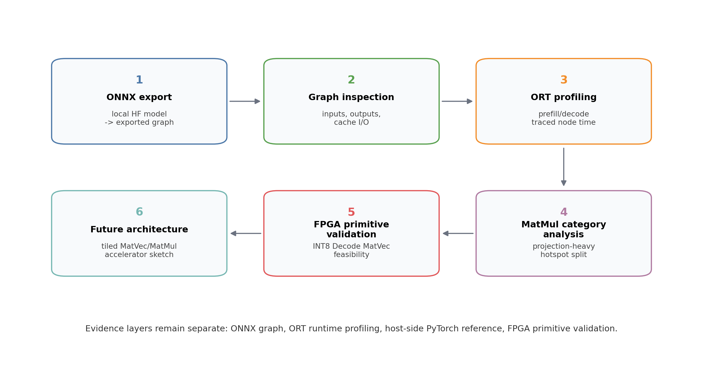
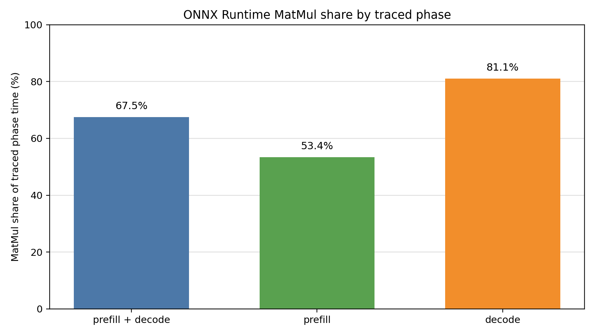
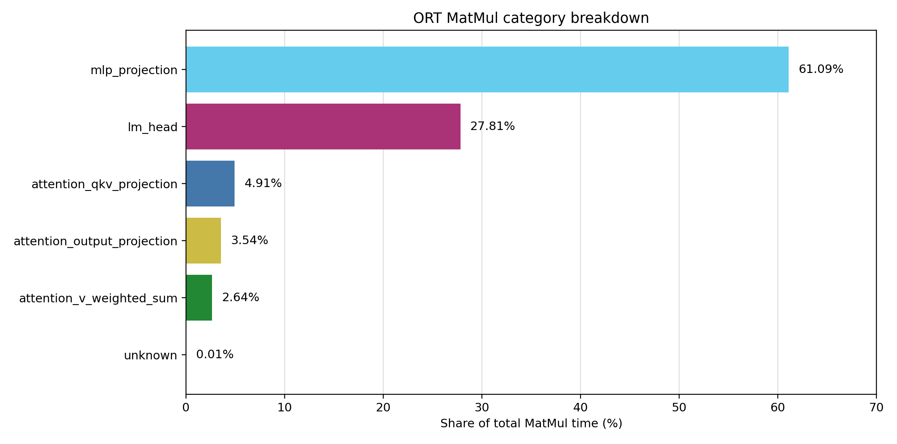
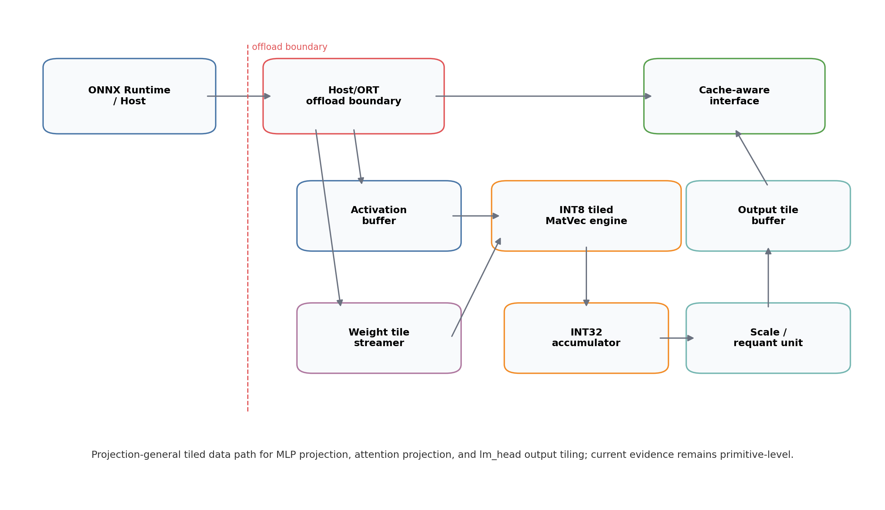

# 한국정보기술진흥원 학술지 / Vol.3 No.2, 2026 하계

# ONNX Runtime 기반 온디바이스 소형 언어모델 추론의 병목 분석 및 FPGA 기반 Decode 가속기 구조 설계

**Bottleneck Analysis of ONNX Runtime-based On-device Small Language Model Inference and Design of an FPGA-based Decode Accelerator Architecture**

최윤혁

한국디지털미디어고등학교

Yunhyuk Choi

Korea Digital Media High School

## 초록

온디바이스 환경에서 소형 언어모델은 클라우드 의존성을 줄이고 개인정보 보호와 저지연 응답을 제공할 수 있다. 그러나 0.xB~1B급 sLLM이라도 ONNX Runtime 기반 추론에서는 모델 내보내기, 그래프 구조, 런타임 실행, 메모리 압력, prefill/decode 단계의 상호작용에 따라 병목 위치가 달라질 수 있다. 본 연구는 Gemma 3 1B의 ONNX export 및 graph inspection, ONNX Runtime CPUExecutionProvider profiling, PyTorch 호스트 측 reference baseline, FPGA primitive-level validation을 결합하여 병목을 증거 기반으로 분석하였다. ONNX Runtime profiling 결과, MatMul은 prefill과 decode를 합산한 traced phase time의 67.5%를 차지했으며, decode 단계에서는 81.1%, prefill 단계에서는 53.4%로 나타났다. 또한 MatMul category 분석에서 `mlp_projection`과 `lm_head`는 전체 MatMul 시간의 88.90%를 차지하였다. 이 결과는 병목을 KV-cache 또는 QK dot-product 하나로 축소하기 어렵다는 점을 보여준다. 이에 따라 본 연구는 FPGA 설계 방향을 MatMul-free 모델 구현이나 QK 전용 가속기가 아니라, MLP projection과 `lm_head`를 포함하는 decode-stage dense tiled MatVec/MatMul 구조로 설정하였다. 하드웨어 결과는 DE10-Lite에서 small fixed-dimension INT8 Decode MatVec primitive bitstream을 configuration한 primitive-level 검증으로 제한하며, full sLLM 실행 또는 end-to-end ONNX Runtime 성능 개선으로 해석하지 않는다.

**키워드:** ONNX Runtime, 온디바이스 추론, 소형 언어모델, prefill, decode, MatMul, MatVec, FPGA, DE10-Lite, primitive validation

## Abstract

On-device small language models can reduce cloud dependency while improving privacy and response latency. However, even 0.xB- to 1B-class sLLMs may exhibit bottlenecks at different layers of an ONNX Runtime deployment, including model export, graph structure, runtime execution, memory pressure, prefill, decode, and interactions among these factors. This study combines Gemma 3 1B ONNX export and graph inspection, ONNX Runtime CPUExecutionProvider profiling, PyTorch host-side reference baselines, and primitive-level FPGA validation. In the ONNX Runtime profile, MatMul accounts for 67.5% of traced prefill-plus-decode phase time, 81.1% of decode traced time, and 53.4% of prefill traced time. Within MatMul time, `mlp_projection` and `lm_head` together account for 88.90%. These results indicate that the observed bottleneck should not be reduced to KV-cache or QK dot-product alone. Accordingly, the FPGA direction in this work is not a MatMul-free model implementation or a QK-only accelerator, but a decode-stage dense tiled MatVec/MatMul architecture for projection-heavy workloads such as MLP projection and `lm_head`. The hardware evidence is limited to primitive-level validation through configuration of a small fixed-dimension INT8 Decode MatVec bitstream on DE10-Lite. It is not interpreted as full sLLM execution or end-to-end ONNX Runtime acceleration.

**Keyword:** ONNX Runtime, on-device inference, small language model, prefill, decode, MatMul, MatVec, FPGA, DE10-Lite, primitive validation

## I. 서론

### 1. 연구 배경

#### 1.1 온디바이스 sLLM 추론의 병목 문제

최근 언어모델은 클라우드 기반 대규모 추론뿐 아니라 모바일, 임베디드 보드, 개인용 PC와 같은 온디바이스 환경으로 확장되고 있다. 본 연구에서 온디바이스 조건은 cloud offload 없이 local host 또는 edge-style deployment 계층에서 모델 export, graph inspection, runtime profiling, primitive validation을 수행하는 환경을 뜻한다. 이는 실제 모바일 NPU, embedded SoC, 또는 제품형 edge device에서의 end-to-end inference 결과를 의미하지 않으며, ONNX Runtime 실행 계층과 FPGA primitive 검증 계층을 분리해 병목과 설계 가능성을 분석하기 위한 연구 범위이다.

Autoregressive language model inference는 prompt 전체를 처리하는 prefill과 token을 순차적으로 생성하는 decode로 나뉜다. Prefill은 긴 sequence를 한 번에 처리하므로 sequence-length-sensitive 연산과 dense projection이 함께 커진다. Decode는 token 단위 반복과 cache 참조가 중요하며, interactive generation에서는 token당 latency가 사용자 경험에 직접적인 영향을 준다.

일반적으로 long-context decode에서는 KV-cache가 중요한 구조적 요인으로 작동한다. 그러나 cache I/O가 존재한다는 사실만으로 전체 병목을 KV-cache만으로 설명할 수는 없다. 실제 병목은 ONNX graph 구조, provider 실행 방식, operator별 traced time, tensor shape manipulation, memory movement를 함께 검토해야 한다.

#### 1.2 ONNX Runtime 기반 분석의 필요성

PyTorch 또는 Transformers 기반 실행은 모델 동작을 이해하는 데 유용하지만, ONNX Runtime 배포 계층의 graph execution 특성을 직접 대체하지 않는다. Raw Hugging Face `safetensors` directory는 ONNX Runtime에서 직접 실행되지 않으므로 export, graph inspection, profiling을 단계적으로 분리해야 한다. 특히 `past_key_values`와 `present` 계열 cache interface가 graph에 노출되는지 확인해야 decode cache reuse profiling이 가능하다.

본 연구는 ONNX export와 graph inspection을 먼저 수행하고, 그 결과를 기반으로 ONNX Runtime CPUExecutionProvider profiling을 수행하였다. PyTorch sweep은 host-side reference baseline으로만 사용하며, ONNX Runtime 결과와 동일한 evidence layer로 취급하지 않는다.

#### 1.3 연구 목표와 기여

본 연구의 목표는 ONNX Runtime 기반 온디바이스 sLLM 추론에서 병목이 어디에 나타나는지 확인하고, 그 결과를 바탕으로 과장 없는 FPGA Decode 가속기 구조의 1차 방향을 제시하는 것이다. 주요 기여는 다음과 같다.

1. ONNX export, graph inspection, runtime profiling, PyTorch 호스트 측 reference baseline, FPGA primitive validation을 구분한 재현 가능한 분석 흐름을 제시한다.
2. ONNX Runtime CPUExecutionProvider profiling에서 MatMul 중심 dense linear algebra가 주요 hotspot임을 보이고, `mlp_projection + lm_head`가 MatMul 시간의 88.90%를 차지함을 정리한다.
3. KV-cache를 long-context decode memory pressure의 대표적 구조 요인으로 다루되, 유일한 병목으로 단정하지 않는다.
4. QK 단일 primitive가 아니라 MLP projection과 `lm_head`를 포함하는 decode-stage tiled MatVec/MatMul 구조를 FPGA 설계 방향으로 제안한다.
5. DE10-Lite에서 small fixed-dimension INT8 Decode MatVec primitive bitstream을 configuration한 board programming evidence를 기록한다.

## II. 본론

### 1. 배경 및 관련 연구

#### 1.1 Prefill과 Decode

Transformer 기반 causal language model의 추론은 prefill과 decode로 구분된다. Prefill은 입력 prompt 전체에 대해 attention, MLP, normalization, output projection을 수행한다. 이 단계에서는 sequence length에 비례하거나 그 이상으로 증가하는 연산이 나타나며, 긴 context일수록 tensor operation과 memory movement도 함께 커진다.

Decode는 이전 token의 cache를 참조하면서 다음 token을 하나씩 생성한다. Batch와 token dimension은 작아질 수 있지만, layer마다 MLP projection, attention projection, `lm_head` projection이 반복된다. 따라서 decode 병목은 attention score 계산뿐 아니라 반복적인 dense projection과 cache 관련 data movement의 결합으로 해석해야 한다.

#### 1.2 KV-cache와 long-context memory pressure

KV-cache는 autoregressive decode에서 이전 token의 key/value tensor를 재사용하기 위한 구조이다. Cache reuse는 매 token마다 과거 sequence를 다시 계산하지 않도록 하지만, context가 길어질수록 cache tensor의 크기, stream, update, concat, shape manipulation이 runtime과 memory pressure를 증가시킬 수 있다.

본 연구에서는 ONNX graph가 52개의 cache input과 52개의 cache output을 노출하며 decode cache reuse가 가능한 interface를 제공함을 확인하였다. 그러나 본 연구는 cache I/O의 존재를 병목의 단일 원인으로 해석하지 않는다. KV-cache는 long-context decode를 설명하는 구조적 요인 중 하나이며, 실제 runtime hotspot은 profiling 결과로 확인해야 한다.

#### 1.3 ONNX Runtime과 graph-based deployment

ONNX Runtime은 ONNX graph를 다양한 provider에서 실행하기 위한 runtime이다. 이 계층에서는 graph optimization, execution provider, memory planner, operator implementation에 따라 성능 특성이 달라진다. 그러므로 모델 파일의 이론적 연산량만으로 온디바이스 병목을 판단하기 어렵다.

본 연구는 ONNX export 상태, graph input/output, operator histogram, cache interface를 먼저 확인하고, 이후 runtime profiling trace를 분석하였다. 이러한 절차는 PyTorch reference baseline과 ONNX Runtime profiling을 혼동하지 않기 위한 전제이다.

#### 1.4 저정밀 및 MatMul-efficient 연구와 본 연구의 차이

BitNet b1.58은 LLM weight를 ternary 값으로 제한하여 저정밀 모델과 전용 하드웨어 가능성을 논의한 관련 연구이다. Scalable MatMul-free Language Modeling은 MatMul 연산을 제거하거나 대체하는 모델 구조를 제안한 관련 연구이다. 이러한 연구는 LLM 효율화 방향을 보여주지만, 본 연구의 구현 방향과는 다르다.

본 연구는 MatMul-free 모델을 새로 학습하거나 Gemma 3 1B의 모델 구조를 MatMul-free 구조로 변경하지 않는다. 또한 BitNet b1.58과 같은 ternary training recipe를 적용하지 않는다. 본 연구는 기존 ONNX Runtime profiling에서 관측된 dense projection 병목을 보존한 채, 그 workload를 저정밀 tiled MatVec/MatMul primitive와 future accelerator architecture로 연결하는 데 초점을 둔다.

### 2. 연구 방법

#### 2.1 전체 실험 흐름

본 연구의 실험 흐름은 여섯 evidence layer로 구성된다. 첫째, local Hugging Face Gemma 3 1B model directory를 inspection하여 모델 구성과 cache 관련 기본 정보를 확인하였다. 둘째, ONNX export를 수행하고 export 성공 여부와 산출 파일을 기록하였다. 셋째, export된 ONNX graph의 input/output, cache I/O, operator 구성을 inspection하였다. 넷째, ONNX Runtime CPUExecutionProvider에서 prefill/decode profiling을 수행하였다. 다섯째, PyTorch host-side reference baseline을 별도로 기록하였다. 여섯째, FPGA primitive validation으로 INT8 Decode MatVec primitive의 simulation, Quartus compile, DE10-Lite bitstream configuration evidence를 기록하였다.

이 흐름은 full accelerator 구현을 주장하기 위한 절차가 아니라, ONNX-centered 병목 분석과 primitive-level hardware validation을 구분하기 위한 연구 절차이다.

그림 1. ONNX export, graph inspection, ONNX Runtime profiling, MatMul category analysis, FPGA primitive validation, future accelerator 구조 제안을 구분한 전체 연구 흐름.

#### 2.2 ONNX export 및 graph inspection

ONNX export는 Gemma 3 1B local model directory에서 수행되었으며, export 결과는 `/home/monad/develop/ai_accel/gemma3-1B-onnx/model.onnx`로 기록되었다. Graph inspection에서는 graph node 수, MatMul node 수, cache input/output 수, decode cache reuse 가능 여부를 확인하였다. Cache-style interface는 `past_key_values`와 `present` 계열 입출력으로 나타났다.

Graph inspection은 runtime 병목 자체를 증명하지 않는다. 이 단계의 역할은 ONNX Runtime profiling이 어떤 graph interface 위에서 수행되는지를 명확히 하는 것이다.

#### 2.3 ORT profiling setup

ONNX Runtime profiling은 `CPUExecutionProvider`를 사용하였다. Context length는 128, 512, 1024, 2048로 설정하고, decode steps는 1, 2, 4, 8로 설정하였다. 각 조합은 runs 3, warmup 1 조건으로 수행된 기존 artifact를 사용하였다. 본 논문에서는 새 profiling을 실행하지 않고, `paper_assets/tables/ort_context_sweep_latency.csv`, `paper_assets/tables/ort_operator_share_by_context.csv`, `paper_assets/tables/ort_prefill_decode_comparison.csv`에 저장된 결과를 사용하였다.

본 논문에서 `traced phase time`은 ORT profiling trace에 기록된 해당 prefill 또는 decode phase의 node event duration 합계를 의미하며, wall-clock latency 전체나 profiling되지 않은 host-side overhead를 포함하지 않는다.

#### 2.4 MatMul category classification 방법

MatMul category 분석은 ORT profile JSON의 `Node` event 중 `op_name == "MatMul"`인 항목을 대상으로 수행되었다. Profile event의 normalized node name을 ONNX graph node name에 우선 매칭하고, graph metadata는 보조 fallback으로만 사용하였다. Category는 node name/path가 명확한 경우에만 부여하였다.

분류 규칙은 다음과 같다. `q_proj`, `k_proj`, `v_proj`는 `attention_qkv_projection`으로 분류하였다. `o_proj`는 `attention_output_projection`으로, `mlp/*_proj`는 `mlp_projection`으로, `lm_head`는 `lm_head`로 분류하였다. Attention 내부 MatMul 중 output shape가 attention score 또는 V weighted sum 형태로 확인되는 경우 각각 `attention_qk_score`, `attention_v_weighted_sum`으로 분류하였다. 확정할 수 없는 항목은 `unknown`으로 남겼다.

#### 2.5 FPGA Decode MatVec primitive 설계 방법

FPGA primitive는 기존 INT8 QK dot-product 검증 흐름을 확장하여, projection workload에 더 가까운 small fixed-dimension INT8 Decode MatVec 구조로 구성하였다. SpinalHDL 구현은 `inputDim=16`, `outputDim=4`, sequential mode, INT8 activation vector, INT8 weight tile matrix, INT32 accumulation을 사용한다. Simulation은 deterministic activation/weight vector를 입력으로 하며, software reference와 RTL output을 비교한다.

DE10-Lite demo top은 선택된 output accumulator의 lower 16-bit를 `HEX3..HEX0`에 표시할 수 있도록 구성하였다. 이 design은 full model integration이 아니라 primitive-level synthesis 및 configuration evidence를 얻기 위한 작은 고정 차원 demo이다.

#### 2.6 Evidence layer 구분

본 연구는 다음 evidence layer를 엄격히 구분한다. ONNX graph evidence는 export된 model interface와 cache I/O 존재 여부를 설명한다. ORT runtime profiling evidence는 CPUExecutionProvider에서 관측된 prefill/decode runtime hotspot을 설명한다. PyTorch reference evidence는 local `safetensors` 모델의 host-side reference behavior를 보여주지만, ORT profiling 결과로 대체하지 않는다. FPGA primitive evidence는 small INT8 Decode MatVec primitive의 simulation, compile, bitstream configuration을 보여주며, full accelerator 성능을 의미하지 않는다.

### 3. 실험 결과

#### 3.1 ONNX graph inspection 결과

표 1은 ONNX graph inspection의 핵심 수치를 정리한다.

**표 1. ONNX graph inspection 요약**

| 항목 | 값 | 출처 |
| --- | ---: | --- |
| ONNX graph node 수 | 7837 | `onnx_profile/results_onnx/raw/onnx_graph_inspection.json` |
| ONNX MatMul node 수 | 237 | `onnx_profile/results_onnx/raw/onnx_graph_inspection.json` |
| cache input 수 | 52 | `onnx_profile/results_onnx/raw/onnx_graph_inspection.json` |
| cache output 수 | 52 | `onnx_profile/results_onnx/raw/onnx_graph_inspection.json` |
| decode cache reuse ready | True | `onnx_profile/results_onnx/raw/onnx_graph_inspection.json` |

표 1은 ONNX graph가 cache-style interface를 제공한다는 점을 보여준다. 그러나 cache input/output의 존재는 병목 원인을 직접 증명하지 않는다.

#### 3.2 ONNX Runtime profiling 결과

표 2는 ONNX Runtime profiling 설정과 산출물을 정리한다.

**표 2. ONNX Runtime profiling 설정 및 산출물**

| 항목 | 설정 또는 산출물 | 출처 |
| --- | --- | --- |
| Runtime provider | ONNX Runtime `CPUExecutionProvider` | `docs/onnx_runtime_sweep_report.md` |
| Context length | 128, 512, 1024, 2048 | `paper_assets/tables/ort_context_sweep_latency.csv` |
| Decode steps | 1, 2, 4, 8 | `paper_assets/tables/ort_context_sweep_latency.csv` |
| Runs / warmup | 3 / 1 | `docs/onnx_runtime_sweep_report.md` |
| Operator share table | operator별 traced node time 비중 | `paper_assets/tables/ort_operator_share_by_context.csv` |
| MatMul category table | MatMul node category별 누적 시간 | `paper_assets/tables/ort_matmul_category_by_context.csv` |

표 3은 MatMul이 traced phase time에서 차지한 비중을 요약한다.

**표 3. ONNX Runtime MatMul phase 비중**

| 측정 범위 | MatMul time | traced phase time | MatMul 비중 | 출처 |
| --- | ---: | ---: | ---: | --- |
| prefill + decode traced phase time | 37.918 s | 56.168 s | 67.5% | `docs/current_bottleneck_implications.md` |
| prefill traced phase time | 14.711 s | 27.539 s | 53.4% | `docs/current_bottleneck_implications.md` |
| decode traced phase time | 23.207 s | 28.629 s | 81.1% | `docs/current_bottleneck_implications.md` |

표 2는 profiling 설정이 CPUExecutionProvider에 한정되어 있음을 명확히 한다. 표 3은 현재 ONNX Runtime profiling에서 MatMul 중심 dense linear algebra가 가장 큰 traced runtime hotspot임을 보여준다. Decode 단계에서 MatMul 비중이 81.1%로 높게 나타났기 때문에, token 단위 반복 실행에서 dense projection workload가 중요한 설계 대상이 된다.

그림 2. ONNX Runtime traced phase time에서 MatMul이 차지하는 비중. 수치는 `docs/current_bottleneck_implications.md`의 기존 ORT profiling 해석값을 시각화한 것이다.

#### 3.3 MatMul category 분석 결과

표 4는 MatMul 내부 category별 누적 시간과 비중을 정리한다.

**표 4. MatMul category별 누적 시간과 비중**

| MatMul category | call count | 누적 시간 | 전체 MatMul 시간 비중 | 출처 |
| --- | ---: | ---: | ---: | --- |
| `mlp_projection` | 14976 | 23163.290 ms | 61.09% | `paper_assets/tables/ort_matmul_category_by_context.csv` |
| `lm_head` | 192 | 10546.540 ms | 27.81% | `paper_assets/tables/ort_matmul_category_by_context.csv` |
| `attention_qkv_projection` | 14976 | 1861.004 ms | 4.91% | `paper_assets/tables/ort_matmul_category_by_context.csv` |
| `attention_output_projection` | 4992 | 1343.254 ms | 3.54% | `paper_assets/tables/ort_matmul_category_by_context.csv` |
| `attention_v_weighted_sum` | 4992 | 1001.248 ms | 2.64% | `paper_assets/tables/ort_matmul_category_by_context.csv` |
| `unknown` | 384 | 2.787 ms | 0.01% | `paper_assets/tables/ort_matmul_category_by_context.csv` |
| `attention_qk_score` | 0 | 0.000 ms | 0.00% | `docs/ort_matmul_hotspot_analysis.md` |
| `mlp_projection + lm_head` | 15168 | 33709.830 ms | 88.90% | `docs/ort_matmul_hotspot_analysis.md` |

표 4는 MatMul 내부에서도 `mlp_projection`과 `lm_head`가 대부분을 차지함을 보여준다. 따라서 FPGA 설계 방향은 QK dot-product 하나로 축소하기보다, 반복적인 dense projection workload를 처리하는 tiled MatVec/MatMul datapath로 확장하는 것이 타당하다. 단, `attention_qk_score`가 0.00%로 나타난 것은 QK 연산이 존재하지 않는다는 뜻이 아니라, 현재 node name/path 기반 분류 규칙으로 확정 가능한 event가 없었다는 뜻으로 제한해서 해석해야 한다.

그림 3. `paper_assets/tables/ort_matmul_category_by_context.csv`의 기존 MatMul category 누적 시간을 전체 MatMul 시간 비중으로 시각화한 결과.

#### 3.4 INT8 Decode MatVec RTL simulation 결과

표 5는 INT8 Decode MatVec RTL simulation 결과를 보여준다.

**표 5. INT8 Decode MatVec RTL simulation 결과**

| output index | expected | observed | pass | input dimension | output dimension | cycles | 출처 |
| ---: | ---: | ---: | --- | ---: | ---: | ---: | --- |
| 0 | -271 | -271 | true | 16 | 4 | 65 | `paper_assets/tables/decode_matvec_int8_sim.csv` |
| 1 | 239 | 239 | true | 16 | 4 | 65 | `paper_assets/tables/decode_matvec_int8_sim.csv` |
| 2 | 287 | 287 | true | 16 | 4 | 65 | `paper_assets/tables/decode_matvec_int8_sim.csv` |
| 3 | 797 | 797 | true | 16 | 4 | 65 | `paper_assets/tables/decode_matvec_int8_sim.csv` |

표 5는 small fixed-dimension INT8 Decode MatVec primitive가 RTL simulation에서 deterministic software reference와 일치함을 보여준다.

#### 3.5 Quartus 합성 및 DE10-Lite programming 결과

표 6은 Decode MatVec demo의 Quartus resource 결과를 정리한다.

**표 6. Decode MatVec demo Quartus resource 요약**

| 항목 | 사용량 | 전체 | 비중 | 출처 |
| --- | ---: | ---: | ---: | --- |
| Total logic elements | 239 | 49,760 | <1% | `paper_assets/tables/decode_matvec_fpga_resource.csv` |
| Total combinational functions | 222 | 49,760 | <1% | `paper_assets/tables/decode_matvec_fpga_resource.csv` |
| Dedicated logic registers | 115 | 49,760 | <1% | `paper_assets/tables/decode_matvec_fpga_resource.csv` |
| Total pins | 65 | 360 | 18% | `paper_assets/tables/decode_matvec_fpga_resource.csv` |
| Total memory bits | 0 | 1,677,312 | 0% | `paper_assets/tables/decode_matvec_fpga_resource.csv` |
| Embedded Multiplier 9-bit elements | 1 | 288 | <1% | `paper_assets/tables/decode_matvec_fpga_resource.csv` |

표 7은 timing 및 board programming 결과를 함께 요약한다.

**표 7. Decode MatVec demo timing 및 board programming 요약**

| 항목 | 값 | 출처 |
| --- | --- | --- |
| Slow 1200mV 85C setup slack | 7.316 ns | `paper_assets/tables/decode_matvec_fpga_timing.csv` |
| Slow 1200mV 85C hold slack | 0.347 ns | `paper_assets/tables/decode_matvec_fpga_timing.csv` |
| Slow 1200mV 85C minimum pulse width slack | 9.637 ns | `paper_assets/tables/decode_matvec_fpga_timing.csv` |
| Programming tool | Quartus Prime Programmer 25.1std.0 Build 1129 10/21/2025 SC Lite Edition | `paper_assets/tables/decode_matvec_board_validation.csv` |
| Programming cable | USB-Blaster [USB-0] | `paper_assets/tables/decode_matvec_board_validation.csv` |
| Programming file | `de10_lite_decode_matvec.sof` | `paper_assets/tables/decode_matvec_board_validation.csv` |
| Target device | `10M50DAF484` | `paper_assets/tables/decode_matvec_board_validation.csv` |
| Programming status | configuration succeeded, 0 errors, 0 warnings | `paper_assets/tables/decode_matvec_board_validation.csv` |

표 6은 demo가 DE10-Lite resource budget 내에서 합성 가능한 규모임을 보여준다. 표 7은 timing summary와 Windows Quartus Programmer configuration 성공을 기록한다. 이 evidence는 bitstream configuration 성공에 한정되며, accumulator numeric output의 board-level 관측과는 분리된다.

DE10-Lite programming screenshot 또는 board photo는 HWP/PDF 제출본에서 추가 evidence figure로 첨부할 수 있다.

### 4. 논의

#### 4.1 병목은 KV-cache만으로 설명되지 않음

ONNX graph는 cache input 52개와 cache output 52개를 제공하므로 KV-cache는 decode profiling에서 중요한 구조적 요소이다. 그러나 현재 runtime profiling에서 가장 큰 traced hotspot은 MatMul이다. 따라서 KV-cache는 long-context memory pressure를 설명하는 대표적 구조 요인이지만, 현재 결과를 모두 설명하는 유일한 원인으로 해석하지 않는다.

#### 4.2 Decode에서 MatMul이 지배적인 이유

Decode에서는 token 단위 실행이 반복되며, 각 layer에서 attention projection, MLP projection, output projection이 계속 수행된다. Batch와 token dimension이 작더라도 hidden dimension과 projection dimension은 유지되므로 dense linear algebra의 누적 시간이 크다. 본 연구의 결과에서 decode MatMul 비중이 81.1%로 나타난 것은 이러한 구조와 일치한다.

#### 4.3 MLP projection과 lm_head의 설계 함의

`mlp_projection`은 layer마다 `gate_proj`, `up_proj`, `down_proj` 형태로 반복되며, `lm_head`는 vocabulary projection 때문에 output dimension이 매우 크다. 두 category가 MatMul 시간의 88.90%를 차지한다는 점은 FPGA 설계가 attention QK score만이 아니라 projection-heavy workload를 다루어야 함을 시사한다. 특히 `lm_head`는 weight streaming, tiling, output reduction 또는 top-k 처리 전략과 함께 검토되어야 한다.

#### 4.4 병목 분석으로부터 도출한 FPGA 설계 요구사항

ONNX Runtime profiling 결과는 FPGA 구조를 직접 결정하지 않지만, 어떤 연산과 data movement를 우선 고려해야 하는지에 대한 설계 요구사항을 제공한다. 표 8은 본 연구에서 관측한 ONNX/ORT evidence를 accelerator requirement로 연결한 것이다.

**표 8. ONNX/ORT 병목 분석으로부터 도출한 FPGA 설계 요구사항**

| ONNX/ORT 관측 결과 | 설계 함의 | Accelerator requirement |
| --- | --- | --- |
| Decode MatMul 비중 81.1% | Decode 단계의 token-wise dense projection이 주요 runtime hotspot으로 나타남 | Decode-stage INT8 tiled MatVec engine |
| `mlp_projection + lm_head`가 MatMul 시간의 88.90% | QK 전용 datapath보다 projection workload 전반을 처리하는 구조가 필요함 | MLP, attention projection, `lm_head`에 공통 적용 가능한 projection-general datapath |
| `lm_head`의 large vocabulary projection | Weight와 output dimension이 커서 단일 고정 dot-product보다 streaming과 tile 단위 출력 처리가 중요함 | Tiled weight streaming, output tiling, partial reduction 또는 top-k 연계 가능 interface |
| Cache input/output 52개 | Decode cache reuse가 graph interface에 노출되므로 host/runtime boundary에서 cache tensor를 명시적으로 다루어야 함 | Cache-aware host interface와 past/present tensor binding strategy |
| Long-context decode에서 `Expand`, `Concat`, `Unsqueeze` 등 shape-related operator가 증가 | Hardware datapath만으로는 graph-level overhead를 모두 줄일 수 없으며 runtime-side specialization이 필요함 | Shape/fusion/static specialization 후보를 고려하는 Host/ORT offload boundary |
| DE10-Lite resource 제한과 small demo compile 결과 | 전체 모델 구현보다 검증 가능한 작은 block으로 설계를 축소해 toolchain feasibility를 확인해야 함 | Primitive-level validation, deterministic vectors, simulation/synthesis/timing/configuration evidence |

### 5. FPGA 기반 Decode 가속기 구조

본 절의 구조는 future accelerator architecture sketch이며, 현재 구현된 full accelerator가 아니다. 제안 구조는 ONNX Runtime profiling에서 확인된 projection-heavy bottleneck을 기준으로 한다. 핵심은 MatMul을 모델에서 제거하는 것이 아니라, decode 단계에서 반복되는 dense projection을 low-precision tiled MatVec/MatMul datapath로 다룰 수 있는 구조를 정의하는 것이다.

병목 분석 결과는 FPGA 구조 요구사항으로 다음과 같이 이어진다. Decode traced time에서 MatMul 비중이 높고, 그 내부에서 `mlp_projection`과 `lm_head`가 지배적이므로 datapath는 QK score 전용 fixed block이 아니라 projection-general tiled MatVec/MatMul 구조여야 한다. 또한 `lm_head`의 large output dimension은 output tile buffer와 host-side reduction 또는 top-k 연계를 요구하며, cache input/output이 graph interface에 노출된 점은 Host/ORT offload boundary가 cache tensor binding과 accelerator invocation을 함께 관리해야 함을 의미한다. 따라서 제안 구조는 activation buffer, weight tile streamer, INT8 tiled MatVec engine, INT32 accumulator, scale/requant unit, output tile buffer, cache-aware interface를 포함하는 future accelerator sketch로 정리한다.

그림 4. ONNX Runtime 병목 분석 결과를 반영한 FPGA Decode tiled MatVec/MatMul accelerator 구조. 이 그림은 future architecture sketch이며, 현재 FPGA 결과는 small fixed-dimension INT8 Decode MatVec primitive 검증에 한정된다.

**표 9. 제안 FPGA Decode 가속기 구조의 구성요소와 역할**

| 구성요소 | 역할 | 관련 병목 근거 | 현재 검증 상태 |
| --- | --- | --- | --- |
| ONNX Runtime / Host | ONNX graph 실행, tensor binding, offload 후보 호출을 관리 | ORT profiling 결과가 CPUExecutionProvider graph 실행 계층에서 관측됨 | Architecture proposal only |
| Host/ORT offload boundary | projection workload, shape 정보, quantization state, cache binding을 accelerator 호출 단위로 정리 | MatMul hotspot과 `Expand`, `Concat`, `Unsqueeze` 등 runtime-side overhead가 함께 관측됨 | Future integration target |
| Activation buffer | decode token activation tile을 유지하고 여러 output tile에서 재사용 | Decode는 token dimension이 작고 projection 반복이 많아 activation reuse가 중요함 | Primitive dataflow concept |
| Weight tile streamer | MLP projection, attention projection, `lm_head` weight tile을 순차 공급 | `mlp_projection + lm_head`가 MatMul 시간의 88.90%를 차지 | Future accelerator component |
| INT8 tiled MatVec/MatMul engine | projection-general INT8 multiply-accumulate datapath 제공 | Decode MatMul 비중 81.1%, projection-heavy category breakdown | Small fixed-dimension INT8 Decode MatVec primitive 검증 |
| INT32 accumulator | input tile별 partial sum을 output tile 단위로 누산 | Dense projection은 누산 폭과 partial sum 관리가 필요함 | Primitive-level RTL simulation 범위 |
| Scale/requant unit | accumulator 결과를 downstream low-precision format으로 변환 | Future quantized ORT/offload path에서 필요 | Architecture proposal only |
| Output tile buffer | `lm_head`와 large projection output을 tile 단위로 저장 또는 host에 반환 | `lm_head`가 MatMul 시간의 27.81%를 차지하고 output dimension이 큼 | Future accelerator component |
| Cache-aware interface | past/present tensor binding, cache layout, stream timing을 Host/ORT와 조율 | ONNX graph cache input/output이 각각 52개이며 long-context pressure와 관련됨 | Interface requirement only |

#### 5.1 설계 목표와 비목표

설계 목표는 ONNX Runtime profiling에서 관측된 decode-stage MatMul hotspot을 hardware-friendly primitive와 dataflow로 변환하는 것이다. 이를 위해 MLP projection, attention projection, `lm_head`가 공유할 수 있는 INT8 tiled MatVec datapath, weight tile streaming, INT32 accumulation, scale/requant stage를 제안한다.

비목표도 명확하다. 본 구조는 Gemma 3 1B 전체를 DE10-Lite에서 실행하는 설계가 아니며, full KV-cache storage나 complete transformer block을 현재 구현했다는 주장이 아니다. 또한 ONNX Runtime custom operator로 통합된 end-to-end 성능 결과가 아니라, profiling-derived architecture sketch와 primitive-level validation을 연결하는 설계 설명이다.

#### 5.2 Host/ORT offload boundary

Host/ORT interface는 ONNX Runtime graph에서 어떤 projection workload를 hardware offload 후보로 볼지 결정하는 경계이다. 이 경계는 operator name/path, tensor shape, quantization state, cache binding 정보를 명시적으로 전달해야 한다. 특히 cache input/output이 graph interface에 존재하므로, host side는 `past_key_values`와 `present` tensor의 layout과 lifetime을 accelerator invocation과 분리해서 관리해야 한다.

이 offload boundary는 `Expand`, `Concat`, `Unsqueeze`와 같은 shape-related operator까지 모두 hardware로 옮긴다는 의미가 아니다. 오히려 이러한 operator는 graph rewrite, static shape specialization, fusion 후보로 구분하고, MatVec engine에는 dense projection tile을 안정적으로 공급하는 역할에 집중한다.

#### 5.3 Decode tiled MatVec dataflow

Decode tiled MatVec dataflow는 token activation vector를 activation buffer에 적재하고, output tile 단위로 weight tile을 stream하여 INT8 multiply-accumulate를 수행하는 흐름으로 구성된다. INT8 tiled MatVec engine은 input tile을 순차적으로 읽고 INT32 accumulator에 partial sum을 누산한다. Tile이 끝나면 scale/requant unit이 downstream format에 맞는 변환을 수행하고, output tile buffer에 결과를 저장한다.

이 dataflow는 현재 `inputDim=16`, `outputDim=4` demo처럼 작은 고정 차원 primitive에서 시작하지만, 구조적으로는 projection category 전반에 확장 가능한 tile abstraction을 목표로 한다.

#### 5.4 Weight streaming and tiling strategy

Weight tile streamer는 MLP projection, attention projection, `lm_head`의 weight를 output tile 단위로 공급한다. 현재 profile에서 `mlp_projection + lm_head`가 MatMul 시간의 88.90%를 차지하므로, datapath는 특정 QK score shape에 고정되기보다 일반 projection shape를 받아들일 수 있어야 한다.

Streaming strategy의 핵심은 activation reuse와 weight bandwidth 관리이다. Decode에서는 token activation이 작고 weight matrix가 크므로, activation buffer에 같은 input tile을 유지한 채 여러 output tile을 순차 처리하는 방식이 적합하다. 이 설계는 roofline/model estimate를 실측 성능으로 해석하지 않으며, bandwidth-sensitive projection을 다루기 위한 architecture requirement로만 제시한다.

#### 5.5 lm_head 처리 전략

`lm_head`는 vocabulary dimension이 매우 크기 때문에 일반 MLP projection보다 output tiling의 중요성이 크다. Full vocabulary score를 한 번에 저장하거나 전송하는 방식은 작은 FPGA board의 resource budget과 맞지 않는다. 따라서 future accelerator에서는 output tile buffer, partial reduction, host-side top-k 또는 streaming top-k interface를 함께 검토해야 한다.

본 연구는 `lm_head` 전체를 FPGA에 구현했다고 주장하지 않는다. 다만 ORT profiling에서 `lm_head`가 높은 MatMul 비중을 보였기 때문에, future architecture가 이를 제외한 QK-only structure로 축소되어서는 안 된다는 설계 요구를 도출한다.

#### 5.6 Cache-aware interface의 역할

Cache-aware interface는 KV-cache를 accelerator 내부에 완전히 저장한다는 의미가 아니다. 본 연구에서 확인한 cache input/output 52개는 host/runtime boundary에서 past/present tensor binding을 명확히 해야 함을 보여준다. Accelerator는 dense projection tile을 처리하되, cache tensor의 layout, update, stream timing은 Host/ORT interface와 함께 관리해야 한다.

또한 long-context에서 shape-related operator 시간이 증가한 점은 cache-aware interface가 단순 memory port 이상이어야 함을 시사한다. Static shape specialization, concat 제거, pre-bound cache buffer, graph-level fusion은 future work의 runtime-side 후보이며, 현재 primitive validation의 범위 밖에 둔다.

#### 5.7 현재 primitive 검증과 future accelerator의 차이

현재 FPGA 결과는 INT8 Decode MatVec primitive가 deterministic vector에 대해 RTL simulation에서 software reference와 일치하고, Quartus compile과 timing summary를 통과하며, DE10-Lite bitstream configuration까지 이어질 수 있음을 보여준다. 이는 전체 sLLM 실행 성능을 증명하는 것이 아니라, profiling-derived projection bottleneck을 hardware primitive로 환원했을 때 FPGA toolchain에서 simulation, synthesis, timing, bitstream configuration까지 연결 가능함을 보인다.

Future accelerator는 이 primitive를 Host/ORT offload boundary, projection-general weight streaming, output tiling, cache-aware interface와 결합해야 한다. 따라서 본 절의 구조는 현재 구현 결과를 과장하지 않으면서, ONNX Runtime 병목 분석이 어떤 하드웨어 요구사항으로 이어지는지 명시하는 설계 제안으로 해석해야 한다.

## III. 결론

### 1. 연구 결과 요약

본 연구는 ONNX Runtime 기반 온디바이스 sLLM 추론의 병목을 export, graph inspection, runtime profiling, host-side reference baseline, FPGA primitive validation으로 구분하여 분석하였다. ONNX Runtime CPUExecutionProvider profiling에서는 MatMul이 prefill과 decode를 합산한 traced phase time의 67.5%를 차지했고, decode 단계에서는 81.1%, prefill 단계에서는 53.4%를 차지하였다. MatMul 내부에서는 `mlp_projection + lm_head`가 88.90%를 차지하였다.

이 결과는 병목을 KV-cache 또는 QK dot-product 하나로 축소하는 해석이 부적절함을 보여준다. KV-cache는 long-context decode memory pressure의 중요한 구조적 요인이지만, 현재 profiling evidence에서 가장 큰 runtime hotspot은 dense projection 중심 MatMul workload이다.

FPGA 측면에서는 INT8 Decode MatVec primitive가 RTL simulation에서 software reference와 일치했고, Quartus resource/timing artifact와 Windows Programmer log를 통해 small fixed-dimension bitstream configuration이 가능함을 확인하였다. 이 evidence는 primitive-level validation으로 제한된다.

### 2. 연구의 한계

첫째, ONNX Runtime profiling 결과는 `CPUExecutionProvider` 기반의 제한된 context length 및 decode step sweep에서 얻은 host-side runtime evidence이다. 다른 execution provider, quantization 설정, graph optimization 수준, hardware target에서 동일한 비중이 유지된다고 일반화할 수 없다.

둘째, context sweep은 synthetic prompt와 제한된 run count에 기반한다. 따라서 latency variance, prompt content, batch size, provider scheduling, memory planner behavior에 대한 추가 검증이 필요하다. 본 논문에서는 기존 artifact의 수치만 사용하고 새 sweep을 수행하지 않았다.

셋째, MatMul category 분석은 node name/path와 profile event를 기반으로 한 보수적 분류이다. Graph optimization 또는 fused kernel 때문에 QK score가 다른 형태로 나타날 수 있으며, `attention_qk_score` category의 0.00%는 QK 연산 부재를 의미하지 않는다.

넷째, PyTorch host-side sweep은 ONNX Runtime profiling 결과가 아니라 reference baseline이다. PyTorch 실행에서 관측된 latency 또는 process RSS 변화는 ONNX Runtime graph execution, ORT memory planner, cache I/O behavior를 직접 대체하는 증거로 사용하지 않는다.

다섯째, FPGA 결과는 primitive-level validation이다. 현재 구현은 full KV-cache storage, movement, management를 포함하지 않으며, `lm_head` 전체 vocabulary projection이나 full transformer block을 구현하지 않는다.

여섯째, DE10-Lite board programming screenshot은 `de10_lite_decode_matvec.sof` bitstream configuration 성공을 의미한다. 이 증거는 target device configuration을 보여주지만, accumulator numeric output의 board-level 관측은 별도의 `HEX3..HEX0` 또는 `LEDR` evidence로 기록되어야 한다. 따라서 board programming success만으로 MatVec board-output validation 또는 inference correctness를 주장하지 않는다.

마지막으로, 성능/대역폭 모델은 design estimate이다. `paper_assets/tables/fpga_decode_accel_roofline_estimate.csv`의 compute-bound 또는 bandwidth-bound 판단은 architecture exploration을 위한 추정이며, 실제 custom operator 성능 또는 system-level latency reduction을 측정한 결과가 아니다.

### 3. 후속 연구 방향

향후 연구에서는 Host/ORT interface, activation buffer, weight tile streamer, INT8 tiled MatVec engine, INT32 accumulator, scale/requant unit, optional fusion unit, optional cache-aware interface를 포함하는 decode accelerator architecture를 단계적으로 검증해야 한다. 또한 QK dot-product에서 시작한 attention primitive 검증을 scale, softmax 또는 approximation, V weighted sum, buffer/stream interface로 확장하고, MLP projection과 `lm_head`를 포함하는 projection-general datapath와 비교해야 한다.

ONNX Runtime 측면에서는 execution provider, quantization setting, graph optimization level, static shape specialization, cache tensor binding strategy를 바꾼 추가 profiling이 필요하다. 이러한 후속 검증은 본 연구의 제한된 evidence layer를 확장하되, PyTorch reference, ORT profiling, FPGA primitive evidence를 계속 분리해 해석해야 한다.

## 참고문헌

[1] Shuming Ma, Hongyu Wang, Lingxiao Ma, Lei Wang, Wenhui Wang, Shaohan Huang, Li Dong, Ruiping Wang, Jilong Xue, and Furu Wei. "The Era of 1-bit LLMs: All Large Language Models are in 1.58 Bits." arXiv preprint arXiv:2402.17764, 2024.

[2] Rui-Jie Zhu, Yu Zhang, Steven Abreu, Ethan Sifferman, Tyler Sheaves, Yiqiao Wang, Dustin Richmond, Sumit Bam Shrestha, Peng Zhou, and Jason K. Eshraghian. "Scalable MatMul-free Language Modeling." arXiv preprint arXiv:2406.02528, 2024.

## 저자정보

최윤혁

한국디지털미디어고등학교

ORCID: [0009-0006-3537-0249](https://orcid.org/0009-0006-3537-0249)
