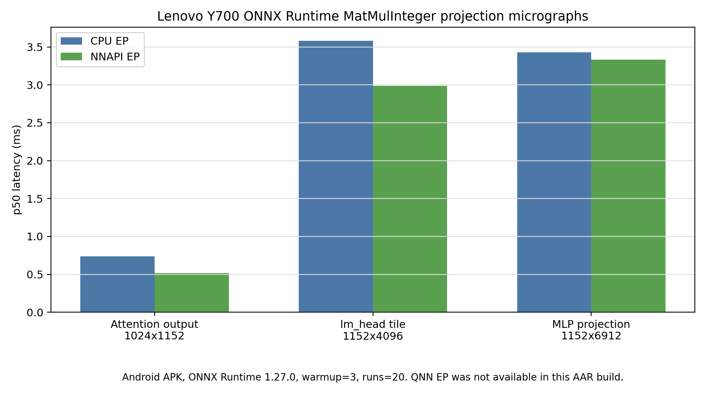
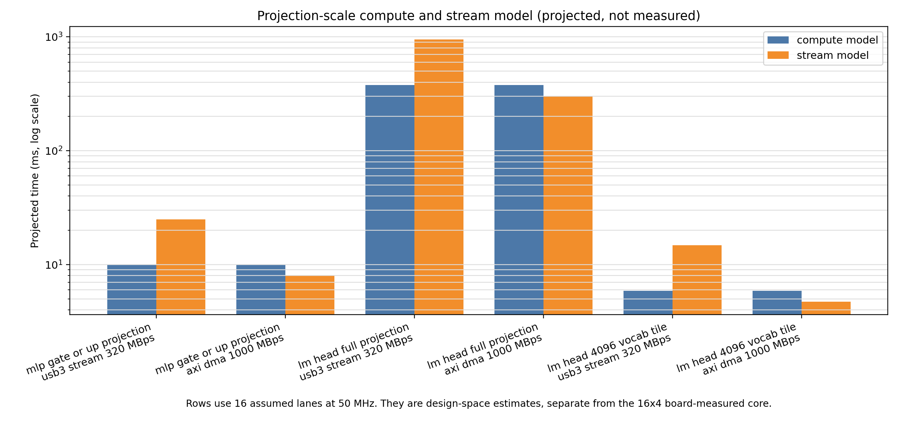

# 한국정보기술진흥원 학술지 / Vol.3 No.2, 2026 하계

# 온디바이스 ONNX Runtime sLLM 추론의 Decode 병목 분석과 FPGA 기반 INT8 MatVec 가속기 구조 제안

**Decode Bottleneck Analysis of On-device ONNX Runtime sLLM Inference and an FPGA-based INT8 MatVec Accelerator Architecture Proposal**

최윤혁

한국디지털미디어고등학교

Yunhyuk Choi

Korea Digital Media High School

## 초록

온디바이스 소형 언어모델(sLLM) 추론에서는 모델 크기뿐 아니라 ONNX graph 구조, execution provider, quantization 상태, decode cache 처리 방식, host/offload interface가 token 단위 실행 비용을 결정한다. 본 연구는 Gemma 계열 sLLM의 ONNX Runtime profiling 결과와 대표 projection micrograph manifest를 바탕으로 decode 단계의 병목을 분석하고, 이를 FPGA 기반 INT8 MatVec 구조 요구사항 및 저자 후속 구조 제안으로 정리한다. 기존 ONNX Runtime CPUExecutionProvider profiling에서는 MatMul이 decode trace node 시간의 81.1%를 차지했으며, MatMul 내부에서는 `mlp_projection`과 `lm_head`가 88.90%를 차지했다. Lenovo Y700(TB320FC, Snapdragon 8+ Gen 1급 taro platform)에서는 ONNX Runtime 1.27.0 Android APK로 representative projection micrograph를 실행했다. INT8 MatMulInteger p50 latency는 CPU EP에서 attention output 0.738 ms, `lm_head` tile 3.582 ms, MLP projection 3.428 ms였고, NNAPI EP에서는 각각 0.518 ms, 2.989 ms, 3.333 ms였다. QNN EP는 사용한 AAR build에서 지원되지 않아 integration blocked로 기록했다. FPGA 측면에서는 DE10-Lite에서 16x4 INT8 MatVec primitive의 board-level correctness를 확인했고, 20회 JTAG-to-Avalon 호출에서 CPU reference와 동일한 결과 및 internal cycle counter 기준 65 cycles, 1.3 us @ 50 MHz를 확보했다. 이 1.3 us 값은 64 MAC smoke-test core의 기능 검증 anchor이며, 빠른 AI 가속 성능이나 ONNX Runtime 대비 우위로 해석하지 않는다. JTAG total latency는 host-tool invocation overhead로만 분리한다. 저자 후속 구조 제안은 1.58bit 계열 변환 기반 가산기 accelerator, 병목 offload FPGA, SRAM-like scratchpad FPGA, DDR2/LPDDR2 다채널 weight memory를 결합하는 memory-centric low-bit MatVec 방향으로 정리한다.

**키워드:** ONNX Runtime, 온디바이스 추론, 소형 언어모델, decode, MatMul, MatVec, FPGA, INT8, DE10-Lite

## Abstract

On-device small language model inference is shaped not only by model size, but also by ONNX graph structure, execution providers, quantization state, decode-cache handling, and host/offload interfaces. This study analyzes decode-stage bottlenecks using ONNX Runtime profiling results and representative projection micrograph manifests for Gemma-class sLLM workloads, then summarizes the observed workload characteristics as requirements for an FPGA-based INT8 MatVec path and as an author-proposed follow-up architecture direction. In the existing ONNX Runtime CPUExecutionProvider profile, MatMul accounts for 81.1% of traced decode node time, while `mlp_projection` and `lm_head` together account for 88.90% of MatMul time. On a Lenovo Y700 Android tablet, an ONNX Runtime 1.27.0 APK benchmark reports INT8 MatMulInteger p50 latencies of 0.738 ms, 3.582 ms, and 3.428 ms for attention-output, `lm_head` tile, and MLP projection micrographs on the CPU EP; the corresponding NNAPI EP p50 latencies are 0.518 ms, 2.989 ms, and 3.333 ms. QNN EP is recorded as integration blocked because it is not supported in the tested AAR build. On the FPGA side, a 16x4 INT8 MatVec primitive is validated on DE10-Lite with board-level correctness: 20 JTAG-to-Avalon invocations match the CPU reference, and the internal cycle counter reports 65 cycles, or 1.3 us at 50 MHz. The 1.3 us value is a functional verification anchor for a 64-MAC smoke-test core, not evidence of fast AI acceleration or superiority over ONNX Runtime. JTAG total latency is separated as host-tool invocation overhead. The follow-up architecture direction is framed as a memory-centric low-bit MatVec design that combines 1.58-bit-family conversion, adder-based acceleration, bottleneck offload FPGA logic, SRAM-like scratchpad reuse, and multi-channel DDR2/LPDDR2 weight memory.

**Keyword:** ONNX Runtime, on-device inference, small language model, decode, MatMul, MatVec, FPGA, INT8, DE10-Lite

## 1. 서론

온디바이스 sLLM 추론은 클라우드 의존성을 낮추고 개인정보 보호와 저지연 응답 가능성을 제공하지만, 실제 배포 계층에서는 모델 파라미터 수만으로 병목을 설명하기 어렵다. Autoregressive language model은 prompt 전체를 처리하는 prefill과 다음 token을 반복 생성하는 decode로 나뉜다. Decode에서는 token dimension이 작아지더라도 hidden dimension, projection dimension, cache tensor의 lifetime은 유지되므로 각 token마다 projection, cache access, graph-level shape operation이 결합된다.

본 연구는 FPGA가 전체 모델을 더 빠르게 실행했다는 성능 주장이 아니라, ONNX Runtime에서 관측되는 decode 병목을 분석하고 이를 FPGA INT8 MatVec/MatMul 구조 요구사항으로 변환하는 것을 목표로 한다. 특히 기존 LLM accelerator 논의가 attention 또는 QK score 중심으로 흐르기 쉬운 점을 고려하여, 실제 ONNX Runtime trace에서 MLP projection과 `lm_head`가 차지하는 비중을 확인하고, QK-only가 아닌 projection-heavy low-bit MatVec/MatMul 경로의 필요성을 검토한다.

본 연구의 기여는 세 가지이다. 첫째, ONNX export, graph inspection, runtime profiling, Android/Y700 실행 하네스, FPGA primitive 검증을 증거 계층별로 분리한다. 둘째, MatMul 중에서도 `mlp_projection`과 `lm_head`가 큰 비중을 차지한다는 점을 바탕으로 memory-centric low-bit MatVec/MatMul 구조 요구사항을 도출한다. 셋째, DE10-Lite 16x4 INT8 MatVec primitive의 board-level correctness와 cycle-counter anchor를 제시하되, 이를 full accelerator 성능으로 해석하지 않고 저자 후속 구조 제안의 검증 출발점으로 둔다.

그림 1은 Android/Y700 실행 경로, ONNX Runtime 분석, FPGA core validation, projection-scale roofline/interface model을 서로 다른 증거 계층으로 분리한 연구 흐름을 나타낸다.

## 2. 관련 연구 및 배경

Transformer 추론에서 prefill은 입력 prompt 전체를 한 번에 처리하고, decode는 cache를 참조하며 token을 순차적으로 생성한다. Decode 단계는 batch와 token dimension이 작아질 수 있지만, 각 layer의 MLP projection, attention projection, `lm_head` projection은 반복된다. 따라서 decode 병목은 attention score 계산뿐 아니라 dense projection, cache movement, graph-level shape operation을 함께 보아야 한다.

KV-cache는 long-context decode에서 핵심 구조이다. Orca는 autoregressive serving에서 iteration-level scheduling의 중요성을 보였고[10], vLLM/PagedAttention은 KV-cache를 block 단위로 관리하여 memory fragmentation과 scheduling 문제를 줄이는 방향을 제시했다[3]. FlashAttention 계열 연구는 attention kernel의 I/O-aware tiling과 work partitioning을 최적화한다[4][11]. 이러한 연구들은 decode와 memory movement의 중요성을 보여주지만, 본 연구는 serving scheduler나 attention kernel 자체를 구현하지 않는다.

ONNX Runtime은 graph optimization과 execution provider를 통해 같은 ONNX graph라도 CPU, NNAPI, QNN 등 다양한 경로로 실행할 수 있다[9]. 온디바이스 배포에서는 provider 선택, quantization state, graph rewrite가 병목을 크게 바꿀 수 있다. 본 연구는 현재 확보된 CPUExecutionProvider trace와 Android 실행 하네스를 분리하여, 측정된 값과 아직 실행되지 않은 경로를 혼동하지 않는다.

FPGA 기반 transformer accelerator 연구로는 FTRANS, DFX, FlightLLM 등이 있다[8][12][13]. 이 연구들은 full model mapping, multi-FPGA appliance, complete mapping flow 등 더 큰 시스템 범위를 다룬다. 본 연구는 이와 달리 full model FPGA 실행이나 custom ONNX Runtime execution provider를 제시하지 않는다. 대신 ONNX Runtime profiling에서 도출된 projection-heavy primitive를 대상으로, 어떤 memory-centric low-bit MatVec 요구사항이 필요한지 분석하고, 최소 INT8 MatVec core가 실제 보드에서 동작함을 확인한다.

## 3. 실험 방법

본 연구의 증거 계층은 표 1과 같이 구분한다. 이 구분은 측정값, 시뮬레이션, projected model, invocation overhead가 같은 성능 순위처럼 읽히지 않도록 하기 위한 핵심 방법론이다.

**표 1. 실험 환경 및 증거 계층 요약**

| 환경 | evidence type | 상태 | claim boundary |
| --- | --- | --- | --- |
| Lenovo Y700 Android | measured APK micrograph | completed | CPU/NNAPI latency 확보, QNN integration blocked |
| ONNX Runtime CPU profile | measured host profile | 기존 profiling artifact | Ryzen/host CPUExecutionProvider trace, Y700 측정 아님 |
| ONNX micrograph manifest | graph evidence | available | 대표 graph shape 확인, Gemma 전체 모델 실행 아님 |
| DE10-Lite INT8 MatVec | board_measured | pass 20/0 | 16x4 core correctness 및 internal cycle anchor |
| Projection roofline | projected | model only | measured latency가 아닌 bandwidth/weight-movement estimate |
| 저자 후속 구조 제안 | proposal | not implemented | 1.58bit 변환, scratchpad FPGA, DDR2/LPDDR2 다채널 memory는 구현 결과가 아님 |

Lenovo Y700 경로에서는 `adb`로 연결된 TB320FC 장치에서 ONNX Runtime 1.27.0 Android APK를 실행했다. 장치는 Android 15, arm64-v8a ABI, Qualcomm taro platform으로 확인되었으며, `/proc/meminfo`의 MemTotal은 15,578,208 kB로 기록되었다. APK는 ONNX model을 asset으로 포함하고 `session.run` wall-clock latency를 warmup 3회, 측정 20회로 기록한다. CPUExecutionProvider와 NNAPIExecutionProvider는 실행되었고, QNNExecutionProvider는 사용한 AAR build의 available provider 목록에 없어 integration blocked로 기록했다.

**표 2. Lenovo Y700 ONNX Runtime projection micrograph 결과**

| micrograph | dtype/op | CPU EP p50 | NNAPI EP p50 | QNN EP |
| --- | --- | ---: | ---: | --- |
| attention output 1024x1152 | INT8 MatMulInteger | 0.738 ms | 0.518 ms | integration blocked |
| `lm_head` tile 1152x4096 | INT8 MatMulInteger | 3.582 ms | 2.989 ms | integration blocked |
| MLP projection 1152x6912 | INT8 MatMulInteger | 3.428 ms | 3.333 ms | integration blocked |
| smoke 16x4 | INT8 MatMulInteger | 0.051 ms | 0.159 ms | integration blocked |

대표 micrograph는 표 3과 같이 생성하였다. 파일명은 intended role을 나타낼 수 있으나, 본 논문에서는 graph inspection으로 확인한 operator, dtype, tensor shape를 기준으로 해석한다.

**표 3. ONNX micrograph manifest 요약**

| model | op | input x weight -> output | dtype |
| --- | --- | --- | --- |
| `matvec_cpu_baseline.onnx` | MatMul | 1x16 x 16x4 -> 1x4 | FLOAT |
| `matvec_int8_matmulinteger.onnx` | MatMulInteger | 1x16 x 16x4 -> 1x4 | INT8 -> INT32 |
| `gemma_mlp_projection_1152x6912_float.onnx` | MatMul | 1x1152 x 1152x6912 -> 1x6912 | FLOAT |
| `gemma_mlp_projection_1152x6912_matmulinteger.onnx` | MatMulInteger | 1x1152 x 1152x6912 -> 1x6912 | INT8 -> INT32 |
| `gemma_lm_head_tile_1152x4096_float.onnx` | MatMul | 1x1152 x 1152x4096 -> 1x4096 | FLOAT |
| `gemma_lm_head_tile_1152x4096_matmulinteger.onnx` | MatMulInteger | 1x1152 x 1152x4096 -> 1x4096 | INT8 -> INT32 |
| `gemma_attention_output_projection_1024x1152_float.onnx` | MatMul | 1x1024 x 1024x1152 -> 1x1152 | FLOAT |
| `gemma_attention_output_projection_1024x1152_matmulinteger.onnx` | MatMulInteger | 1x1024 x 1024x1152 -> 1x1152 | INT8 -> INT32 |

FPGA 검증은 SpinalHDL 기반 INT8 MatVec core, Verilator simulation, Quartus clean rebuild, DE10-Lite JTAG-to-Avalon register invocation으로 구성된다. JTAG path는 correctness/debug path이며, performance interface로 해석하지 않는다.

## 4. ONNX Runtime 및 Micrograph 병목 분석

기존 ONNX Runtime CPUExecutionProvider profiling에서는 decode trace node 시간 중 MatMul이 81.1%를 차지했다. Prefill과 decode를 합산한 trace node 시간에서는 MatMul share가 67.5%, prefill에서는 53.4%였다. Long-decode trace에서도 MatMul은 주요 operator group으로 유지되지만, context 2048과 decode 256 조건에서는 `Expand + Concat + Unsqueeze` 합산 비중이 17.71%까지 증가했다. 이 결과는 decode 병목이 dense projection만으로도, KV-cache만으로도 완전히 설명되지 않으며 두 계층을 함께 다뤄야 함을 의미한다.

**표 4. ONNX Runtime profiling 기반 decode 병목 요약**

| 측정 범위 | 주요 결과 | 해석 |
| --- | ---: | --- |
| decode MatMul share | 81.1% | CPUExecutionProvider trace node time 기준 |
| prefill+decode MatMul share | 67.5% | host CPU profiling artifact |
| `mlp_projection + lm_head` share | 88.90% of MatMul | projection-heavy workload |
| context 2048, decode 256 shape/cache ops | 17.71% | `Expand + Concat + Unsqueeze`, exploratory trace |

MatMul category 분석에서는 `mlp_projection`과 `lm_head`가 전체 MatMul 시간의 88.90%를 차지했다. 따라서 후속 FPGA 구조 요구사항은 QK dot-product 전용 block보다 MLP, attention projection, `lm_head`에 공통 적용 가능한 low-bit MatVec/MatMul 처리를 우선 고려해야 한다. `attention_qk_score`가 runtime classifier에서 0.00%로 나타난 것은 QK 연산 부재가 아니라, 현재 event classifier에서 확정 가능한 MatMul event가 없었다는 뜻으로 제한한다.

Long-decode sweep의 일부 결과는 runs 1, warmup 0 조건으로 수집된 exploratory trace이다. 그러므로 latency benchmark로 해석하지 않고 operator share 경향으로만 사용한다. 최종 온디바이스 latency 판단은 Y700 APK micrograph benchmark를 우선한다.

그림 2는 INT8 MatMulInteger projection micrograph의 p50 latency를 CPU EP와 NNAPI EP로 나누어 나타낸다. 16x4 smoke graph에서는 provider dispatch overhead가 지배적이므로 구조 비교에 쓰지 않고, 1024~6912 output dimension의 projection micrograph를 decode offload 후보의 대표 latency로 본다.

## 5. 병목 분석 기반 FPGA 구조 요구사항과 저자 후속 구조 제안

**저자 검토 필요:** 본 절은 사용자가 제시한 후속 구조 아이디어를 논문 문장으로 정리한 초안이다. 본 연구에서 구현하고 실측한 FPGA 하드웨어는 DE10-Lite 16x4 INT8 MatVec primitive에 한정된다.

Y700 micrograph와 기존 ONNX Runtime profiling은 같은 결론을 가리킨다. Decode 경로에서 반복되는 projection-heavy MatVec/MatMul은 작은 16x4 연산보다 1024~6912 output dimension을 갖는 projection tile에서 의미 있게 관측된다. 따라서 후속 FPGA 구조는 단순히 MAC core cycle을 줄이는 방향보다 weight movement, activation reuse, partial sum reuse, output tile 처리, provider/runtime 호출 경계의 비용을 함께 줄이는 memory-centric low-bit MatVec 구조가 되어야 한다.

**표 5. ONNX Runtime 병목에서 도출한 하드웨어 요구사항**

| 요구사항 | 근거 | 구조적 의미 | 본 논문 상태 |
| --- | --- | --- | --- |
| projection-heavy MatVec/MatMul 우선 | `mlp_projection + lm_head`가 MatMul 시간의 88.90% | QK 전용보다 MLP, attention output, `lm_head` 공통 경로 고려 | 분석 결과 |
| low-bit weight resident 경로 | `lm_head`/MLP tile의 weight movement가 큼 | weight를 반복 전송하지 않는 memory-centric 배치 필요 | 요구사항 |
| activation/partial sum 재사용 | decode는 token 단위 반복 실행 | activation, partial sum, hot tile, output tile buffer 재사용 필요 | 저자 후속 제안 |
| provider/runtime 호출 경계 축소 | 16x4 micrograph는 dispatch overhead 영향이 큼 | 작은 primitive 비교보다 projection-scale boundary 설계 필요 | 분석 결과 |
| graph/cache 처리와 분리된 claim | long-decode에서 shape/cache op 비중 증가 | accelerator 단독 주장보다 graph/runtime specialization과 함께 검토 | 후속 과제 |

저자 후속 구조 제안은 일반 모델을 1.58bit 계열 모델로 변환한 뒤, 곱셈기 중심 datapath 대신 가산기 기반 accelerator를 구성하는 방향이다. 이 제안은 본 논문에서 구현한 결과가 아니라, Y700 병목 분석에서 도출된 projection-heavy MatVec/MatMul 요구사항을 바탕으로 한 후속 연구 방향이다. 구체적으로는 병목 offload용 FPGA NPU, activation과 partial sum 및 hot tile을 재사용하기 위한 SRAM-like scratchpad FPGA, 그리고 DDR2 또는 LPDDR2 기반 low-power weight memory를 결합하는 custom board 방향을 검토한다.

DDR2/LPDDR2는 최신 HBM이나 LPDDR5보다 die당 용량과 단일 채널 대역폭은 작지만, controller 구조가 비교적 단순하고 독립 channel 또는 interleaved group을 늘려 aggregate bandwidth를 높일 수 있다는 장점이 있다. 예를 들어 4Gbit DRAM die 8개 또는 16개를 weight memory로 구성하면 이론 용량은 각각 4GB 또는 8GB가 된다. 본 논문은 이러한 custom board, SRAM-like FPGA, 1.58bit 변환기, Y700-FPGA offload path를 구현했다고 주장하지 않는다.

## 6. DE10-Lite INT8 MatVec primitive 검증 결과

현재 board-measured 결과는 DE10-Lite의 fixed 16x4 INT8 MatVec primitive에 한정된다. 해당 core는 64 MAC smoke-test workload를 수행하며, 새 Verilog mirror를 Windows Pocket4의 Quartus 25.1std Lite에서 clean compile한 뒤 DE10-Lite에 programming하여 20회 JTAG-to-Avalon invocation을 수행했다. 결과는 `pass_count=20`, `fail_count=0`이며 CPU reference와 동일한 result vector를 기록했다. Internal cycle counter는 65 cycles, 50 MHz 기준 1.3 us를 보고했다.

이 1.3 us 값은 빠른 AI 가속 성능이 아니다. 64 MAC smoke-test core가 보드에서 올바르게 동작하고 내부 cycle counter가 예상 범위의 cycle을 보고했다는 기능 검증 anchor이다. 또한 JTAG total latency의 mean/p50/p95 7756.114875 / 7755.08985 / 7775.94519 ms는 System Console host-tool invocation overhead이며, 1.3 us internal compute time과 별개의 물리량이다. 따라서 두 값을 ONNX Runtime latency와 같은 축의 성능 비교로 배치하지 않는다.

**표 6. DE10-Lite board validation summary**

| 항목 | 값 |
| --- | ---: |
| input/output dimension | 16 / 4 |
| MACs | 64 |
| pass_count / fail_count | 20 / 0 |
| compute cycles | 65 |
| compute time | 1.3 us @ 50 MHz |
| logic elements | 2,560 / 49,760 |
| DSP 9-bit elements | 1 / 288 |
| memory bits | 512 / 1,677,312 |
| Fmax | 56.670 MHz |

## 7. Memory/Interface 요구사항과 후속 구조 방향

Projection-scale model은 weight movement와 interface bandwidth가 실제 offload 가능성을 지배할 수 있음을 보여준다. 예를 들어 full `lm_head` 1152->262144 projection은 token당 약 3.02억 MAC과 약 302 MB의 INT8 weight movement를 요구한다. 16 lanes, 50 MHz 가정에서 compute estimate는 약 377 ms이고, USB3 320 MB/s streaming estimate는 약 947 ms이므로, 단순히 FPGA core cycle만 줄인다고 실사용 latency 개선을 주장할 수 없다.

**표 7. Projection tile roofline/interface model 요약**

| component | evidence type | shape | lanes | interface case | compute/stream model |
| --- | --- | --- | ---: | --- | --- |
| MLP gate/up projection | projected | 1152->6912 | 16 | USB3 320 MB/s | compute 9.95 ms, stream 24.97 ms |
| lm_head full projection | projected | 1152->262144 | 16 | USB3 320 MB/s | compute 377.49 ms, stream 947.00 ms |
| lm_head tile | projected | 1152->4096 | 16 | USB3 320 MB/s | projection tile model |

FPGA 간 연결은 본질적으로 불가능하거나 반드시 매우 느린 경로가 아니다. 다만 연산용 FPGA와 SRAM-like scratchpad용 FPGA를 custom connector로 연결하려면 pin count, signal integrity, clock-domain crossing, protocol, aggregate bandwidth, board design 난이도가 함께 증가한다. 따라서 본 논문에서는 해당 custom board를 구현 결과로 쓰지 않고, 병목 분석에서 도출된 후속 구조 요구사항으로만 정리한다.

**표 8. 저자 후속 구조 제안과 해결하려는 병목**

| 구조 후보 | 해결하려는 병목 | 논문 내 지위 | 주의할 claim boundary |
| --- | --- | --- | --- |
| 1.58bit 계열 변환 + 가산기 accelerator | INT8/FP16 곱셈기 중심 MatVec의 area/energy 부담 | 저자 후속 구조 제안 | 변환기나 학습/양자화 flow를 제작한 결과가 아님 |
| 병목 offload FPGA NPU | projection-heavy MatVec/MatMul 반복 비용 | 저자 후속 구조 제안 | Android-FPGA 통합 실측 결과가 아님 |
| SRAM-like scratchpad FPGA | activation, partial sum, hot tile, cache metadata, output tile buffer 재사용 | 저자 후속 구조 제안 | scratchpad board 구현 결과가 아님 |
| DDR2/LPDDR2 다채널 weight memory | large projection weight residency와 aggregate bandwidth | custom board 후보 | 4Gbit die 8~16개는 이론적 4GB~8GB 구성 예시 |
| compute FPGA와 scratchpad FPGA 간 custom connector | memory와 compute 분리 시 bandwidth 제공 | 후속 산출물/포트폴리오 방향 | pin 수, SI, CDC, protocol, board design 검증 필요 |

## 8. 논의 및 결론

본 연구의 결론은 FPGA의 전체 실행 우위를 보였다는 것이 아니라, ONNX Runtime decode trace와 Y700 micrograph에서 projection-heavy workload가 뚜렷하게 나타나며, 이를 FPGA로 옮기려면 memory-centric low-bit MatVec/MatMul 구조 요구사항을 먼저 만족해야 한다는 것이다. KV-cache와 shape-related operator는 long-context decode에서 중요하지만, 현재 evidence에서는 dense projection을 배제한 QK-only 설계가 충분하지 않다.

Y700 실험은 Gemma 전체 모델 실행이 아니라 representative ONNX micrograph benchmark이다. 그럼에도 CPU EP와 NNAPI EP에서 projection-scale MatMul/MatMulInteger latency를 확보했기 때문에, 기존 host-only profiling보다 온디바이스 근거가 강화되었다. QNN EP는 tested AAR build에서 지원되지 않아 integration blocked로 기록했으며, QNN SDK/Qualcomm AI Engine Direct 기반 build가 확보되면 별도 비교가 필요하다.

FPGA 측면에서는 DE10-Lite 16x4 INT8 MatVec 결과가 기능 검증과 cycle 측정 anchor로는 의미가 있지만, projection-scale acceleration을 주장하기에는 interface와 bandwidth가 결정적이다. 저자 후속 구조 제안은 1.58bit 계열 변환 기반 가산기 accelerator, 병목 offload FPGA, SRAM-like scratchpad FPGA, DDR2/LPDDR2 다채널 weight memory를 결합하는 방향이다. 이 제안은 본 논문의 구현 결과가 아니라, 온디바이스 ONNX Runtime 병목 분석에서 출발한 다음 설계 과제이다.

## 참고문헌

[1] Shuming Ma, Hongyu Wang, Lingxiao Ma, Lei Wang, Wenhui Wang, Shaohan Huang, Li Dong, Ruiping Wang, Jilong Xue, and Furu Wei. "The Era of 1-bit LLMs: All Large Language Models are in 1.58 Bits." arXiv preprint arXiv:2402.17764, 2024.

[2] Rui-Jie Zhu, Yu Zhang, Steven Abreu, Ethan Sifferman, Tyler Sheaves, Yiqiao Wang, Dustin Richmond, Sumit Bam Shrestha, Peng Zhou, and Jason K. Eshraghian. "Scalable MatMul-free Language Modeling." arXiv preprint arXiv:2406.02528, 2024.

[3] Woosuk Kwon, Zhuohan Li, Siyuan Zhuang, Ying Sheng, Lianmin Zheng, Cody Hao Yu, Joseph E. Gonzalez, Hao Zhang, and Ion Stoica. "Efficient Memory Management for Large Language Model Serving with PagedAttention." arXiv preprint arXiv:2309.06180, 2023.

[4] Tri Dao, Daniel Y. Fu, Stefano Ermon, Atri Rudra, and Christopher Ré. "FlashAttention: Fast and Memory-Efficient Exact Attention with IO-Awareness." arXiv preprint arXiv:2205.14135, 2022.

[5] Elias Frantar, Saleh Ashkboos, Torsten Hoefler, and Dan Alistarh. "GPTQ: Accurate Post-Training Quantization for Generative Pre-trained Transformers." arXiv preprint arXiv:2210.17323, 2022.

[6] Guangxuan Xiao, Ji Lin, Mickael Seznec, Hao Wu, Julien Demouth, and Song Han. "SmoothQuant: Accurate and Efficient Post-Training Quantization for Large Language Models." arXiv preprint arXiv:2211.10438, 2022.

[7] Ji Lin, Jiaming Tang, Haotian Tang, Shang Yang, Wei-Ming Chen, Wei-Chen Wang, Guangxuan Xiao, Xingyu Dang, Chuang Gan, and Song Han. "AWQ: Activation-aware Weight Quantization for LLM Compression and Acceleration." arXiv preprint arXiv:2306.00978, 2023.

[8] Shulin Zeng, Jun Liu, Guohao Dai, Xinhao Yang, Tianyu Fu, Hongyi Wang, Wenheng Ma, Hanbo Sun, Shiyao Li, Zixiao Huang, Yadong Dai, Jintao Li, Zehao Wang, Ruoyu Zhang, Kairui Wen, Xuefei Ning, and Yu Wang. "FlightLLM: Efficient Large Language Model Inference with a Complete Mapping Flow on FPGAs." arXiv preprint arXiv:2401.03868, 2024.

[9] Microsoft. "ONNX Runtime Execution Providers" and "Graph Optimizations." ONNX Runtime Documentation, https://onnxruntime.ai/docs/execution-providers/ and https://onnxruntime.ai/docs/performance/model-optimizations/graph-optimizations.html, accessed 2026-06-29.

[10] Gyeong-In Yu, Joo Seong Jeong, Geon-Woo Kim, Soojeong Kim, and Byung-Gon Chun. "Orca: A Distributed Serving System for Transformer-Based Generative Models." In 16th USENIX Symposium on Operating Systems Design and Implementation (OSDI 22), pp. 521-538, 2022.

[11] Tri Dao. "FlashAttention-2: Faster Attention with Better Parallelism and Work Partitioning." In 12th International Conference on Learning Representations (ICLR), 2024.

[12] Seongmin Hong, Seungjae Moon, Junsoo Kim, Sungjae Lee, Minsub Kim, Dongsoo Lee, and Joo-Young Kim. "DFX: A Low-latency Multi-FPGA Appliance for Accelerating Transformer-based Text Generation." In Proceedings of the 55th IEEE/ACM International Symposium on Microarchitecture (MICRO), pp. 616-630, 2022.

[13] Bingbing Li, Santosh Pandey, Haowen Fang, Yanjun Lv, Ji Li, Jieyang Chen, Mimi Xie, Lipeng Wan, Hang Liu, and Caiwen Ding. "FTRANS: Energy-Efficient Acceleration of Transformers using FPGA." In ACM/IEEE International Symposium on Low Power Electronics and Design (ISLPED), pp. 175-180, 2020.

## 저자정보

최윤혁

한국디지털미디어고등학교

ORCID: [0009-0006-3537-0249](https://orcid.org/0009-0006-3537-0249)
