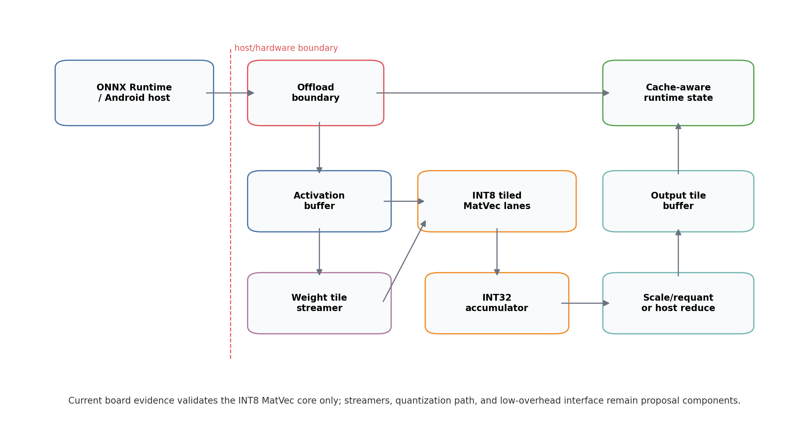

# 한국정보기술진흥원 학술지 / Vol.3 No.2, 2026 하계

# 온디바이스 ONNX Runtime sLLM 추론의 Decode 병목 분석과 FPGA 기반 INT8 MatVec 가속기 구조 제안

**Decode Bottleneck Analysis of On-device ONNX Runtime sLLM Inference and an FPGA-based INT8 MatVec Accelerator Architecture Proposal**

최윤혁

한국디지털미디어고등학교

Yunhyuk Choi

Korea Digital Media High School

## 초록

온디바이스 소형 언어모델(sLLM) 추론에서는 모델 크기뿐 아니라 ONNX graph 구조, execution provider, quantization 상태, decode cache 처리 방식, host/offload interface가 token 단위 실행 비용을 결정한다. 본 연구는 Gemma 계열 sLLM의 ONNX Runtime profiling 결과와 대표 projection micrograph manifest를 바탕으로 decode 단계의 병목을 분석하고, 이를 FPGA 기반 INT8 tiled MatVec/MatMul 구조 요구사항으로 연결한다. 기존 ONNX Runtime CPUExecutionProvider profiling에서는 MatMul이 decode trace node 시간의 81.1%를 차지했으며, MatMul 내부에서는 `mlp_projection`과 `lm_head`가 88.90%를 차지했다. Lenovo Y700(TB320FC, Snapdragon 8+ Gen 1급 taro platform)에서는 ONNX Runtime 1.27.0 Android APK로 representative projection micrograph를 실행했다. INT8 MatMulInteger p50 latency는 CPU EP에서 attention output 0.738 ms, `lm_head` tile 3.582 ms, MLP projection 3.428 ms였고, NNAPI EP에서는 각각 0.518 ms, 2.989 ms, 3.333 ms였다. QNN EP는 사용한 AAR build에서 지원되지 않아 integration blocked로 기록했다. FPGA 측면에서는 DE10-Lite에서 16x4 INT8 MatVec primitive의 board-level correctness를 확인했고, 20회 JTAG-to-Avalon 호출에서 CPU reference와 동일한 결과 및 internal cycle counter 기준 65 cycles, 1.3 us @ 50 MHz를 확보했다. 이 결과는 Gemma 전체 모델의 FPGA 실행이나 ONNX Runtime 전체 실행 가속이 아니라, projection-heavy decode 병목을 FPGA tiled datapath, memory bandwidth, interface 조건으로 연결한 분석 및 primitive-level validation이다.

**키워드:** ONNX Runtime, 온디바이스 추론, 소형 언어모델, decode, MatMul, MatVec, FPGA, INT8, DE10-Lite

## Abstract

On-device small language model inference is shaped not only by model size, but also by ONNX graph structure, execution providers, quantization state, decode-cache handling, and host/offload interfaces. This study analyzes decode-stage bottlenecks using ONNX Runtime profiling results and representative projection micrograph manifests for Gemma-class sLLM workloads, then translates the observed workload characteristics into requirements for an FPGA-based INT8 tiled MatVec/MatMul architecture. In the existing ONNX Runtime CPUExecutionProvider profile, MatMul accounts for 81.1% of traced decode node time, while `mlp_projection` and `lm_head` together account for 88.90% of MatMul time. On a Lenovo Y700 Android tablet, an ONNX Runtime 1.27.0 APK benchmark reports INT8 MatMulInteger p50 latencies of 0.738 ms, 3.582 ms, and 3.428 ms for attention-output, `lm_head` tile, and MLP projection micrographs on the CPU EP; the corresponding NNAPI EP p50 latencies are 0.518 ms, 2.989 ms, and 3.333 ms. QNN EP is recorded as integration blocked because it is not supported in the tested AAR build. On the FPGA side, a 16x4 INT8 MatVec primitive is validated on DE10-Lite with board-level correctness: 20 JTAG-to-Avalon invocations match the CPU reference, and the internal cycle counter reports 65 cycles, or 1.3 us at 50 MHz. These results do not demonstrate whole-model Gemma execution on FPGA or whole-graph ONNX Runtime acceleration. Instead, they provide bottleneck-driven architectural analysis and primitive-level validation for a projection-heavy decode accelerator path.

**Keyword:** ONNX Runtime, on-device inference, small language model, decode, MatMul, MatVec, FPGA, INT8, DE10-Lite

## 1. 서론

온디바이스 sLLM 추론은 클라우드 의존성을 낮추고 개인정보 보호와 저지연 응답 가능성을 제공하지만, 실제 배포 계층에서는 모델 파라미터 수만으로 병목을 설명하기 어렵다. Autoregressive language model은 prompt 전체를 처리하는 prefill과 다음 token을 반복 생성하는 decode로 나뉜다. Decode에서는 token dimension이 작아지더라도 hidden dimension, projection dimension, cache tensor의 lifetime은 유지되므로 각 token마다 projection, cache access, graph-level shape operation이 결합된다.

본 연구는 FPGA가 전체 모델을 더 빠르게 실행했다는 성능 주장이 아니라, ONNX Runtime에서 관측되는 decode 병목을 분석하고 이를 FPGA INT8 MatVec/MatMul 구조 요구사항으로 변환하는 것을 목표로 한다. 특히 기존 LLM accelerator 논의가 attention 또는 QK score 중심으로 흐르기 쉬운 점을 고려하여, 실제 ONNX Runtime trace에서 MLP projection과 `lm_head`가 차지하는 비중을 확인하고, QK-only가 아닌 projection-general datapath의 필요성을 검토한다.

본 연구의 기여는 세 가지이다. 첫째, ONNX export, graph inspection, runtime profiling, Android/Y700 실행 하네스, FPGA primitive 검증을 증거 계층별로 분리한다. 둘째, MatMul 중에서도 `mlp_projection`과 `lm_head`가 큰 비중을 차지한다는 점을 바탕으로 projection-general tiled MatVec/MatMul 구조 요구사항을 도출한다. 셋째, DE10-Lite 16x4 INT8 MatVec primitive의 board-level correctness와 cycle-counter anchor를 제시하되, 이를 full accelerator 성능으로 해석하지 않는다.

그림 1은 Android/Y700 실행 경로, ONNX Runtime 분석, FPGA core validation, projection-scale roofline/interface model을 서로 다른 증거 계층으로 분리한 연구 흐름을 나타낸다.

## 2. 관련 연구 및 배경

Transformer 추론에서 prefill은 입력 prompt 전체를 한 번에 처리하고, decode는 cache를 참조하며 token을 순차적으로 생성한다. Decode 단계는 batch와 token dimension이 작아질 수 있지만, 각 layer의 MLP projection, attention projection, `lm_head` projection은 반복된다. 따라서 decode 병목은 attention score 계산뿐 아니라 dense projection, cache movement, graph-level shape operation을 함께 보아야 한다.

KV-cache는 long-context decode에서 핵심 구조이다. Orca는 autoregressive serving에서 iteration-level scheduling의 중요성을 보였고[10], vLLM/PagedAttention은 KV-cache를 block 단위로 관리하여 memory fragmentation과 scheduling 문제를 줄이는 방향을 제시했다[3]. FlashAttention 계열 연구는 attention kernel의 I/O-aware tiling과 work partitioning을 최적화한다[4][11]. 이러한 연구들은 decode와 memory movement의 중요성을 보여주지만, 본 연구는 serving scheduler나 attention kernel 자체를 구현하지 않는다.

ONNX Runtime은 graph optimization과 execution provider를 통해 같은 ONNX graph라도 CPU, NNAPI, QNN 등 다양한 경로로 실행할 수 있다[9]. 온디바이스 배포에서는 provider 선택, quantization state, graph rewrite가 병목을 크게 바꿀 수 있다. 본 연구는 현재 확보된 CPUExecutionProvider trace와 Android 실행 하네스를 분리하여, 측정된 값과 아직 실행되지 않은 경로를 혼동하지 않는다.

FPGA 기반 transformer accelerator 연구로는 FTRANS, DFX, FlightLLM 등이 있다[8][12][13]. 이 연구들은 full model mapping, multi-FPGA appliance, complete mapping flow 등 더 큰 시스템 범위를 다룬다. 본 연구는 이와 달리 full model FPGA 실행이나 custom ONNX Runtime execution provider를 제시하지 않는다. 대신 ONNX Runtime profiling에서 도출된 projection-heavy primitive를 대상으로, 어떤 tiled INT8 MatVec 구조와 interface 조건이 필요한지 분석하고, 최소 INT8 MatVec core가 실제 보드에서 동작함을 확인한다.

## 3. 실험 방법

본 연구의 증거 계층은 표 1과 같이 구분한다. 이 구분은 측정값, 시뮬레이션, projected model, invocation overhead가 같은 성능 순위처럼 읽히지 않도록 하기 위한 핵심 방법론이다.

**표 1. 실험 환경 및 증거 계층 요약**

| 환경 | evidence type | 상태 | claim boundary |
| --- | --- | --- | --- |
| Lenovo Y700 Android | measured APK micrograph | completed | CPU/NNAPI latency 확보, QNN integration blocked |
| ONNX Runtime CPU profile | measured host profile | 기존 profiling artifact | Ryzen/host CPUExecutionProvider trace, Y700 측정 아님 |
| ONNX micrograph manifest | graph evidence | available | 대표 graph shape 확인, Gemma 전체 모델 실행 아님 |
| DE10-Lite INT8 MatVec | board_measured | pass 20/0 | 16x4 core correctness 및 internal cycle anchor |
| 64x16 tileDim=4 core | simulation | pass | board/timing 측정 아님 |
| Projection roofline | projected | model only | measured latency가 아닌 design-space estimate |

Lenovo Y700 경로에서는 `adb`로 연결된 TB320FC 장치에서 ONNX Runtime 1.27.0 Android APK를 실행했다. 장치는 Android 15, arm64-v8a ABI, Qualcomm taro platform으로 확인되었으며, `/proc/meminfo`의 MemTotal은 15,578,208 kB로 기록되었다. APK는 ONNX model을 asset으로 포함하고 `session.run` wall-clock latency를 warmup 3회, 측정 20회로 기록한다. CPUExecutionProvider와 NNAPIExecutionProvider는 실행되었고, QNNExecutionProvider는 사용한 AAR build의 available provider 목록에 없어 integration blocked로 기록했다.

**표 2. Lenovo Y700 ONNX Runtime projection micrograph 결과**

| micrograph | dtype/op | CPU EP p50 | NNAPI EP p50 | QNN EP |
| --- | --- | ---: | ---: | --- |
| attention output 1024x1152 | INT8 MatMulInteger | 0.738 ms | 0.518 ms | integration blocked |
| `lm_head` tile 1152x4096 | INT8 MatMulInteger | 3.582 ms | 2.989 ms | integration blocked |
| MLP projection 1152x6912 | INT8 MatMulInteger | 3.428 ms | 3.333 ms | integration blocked |
| smoke 16x4 | INT8 MatMulInteger | 0.051 ms | 0.159 ms | integration blocked |

대표 micrograph는 표 3과 같이 생성하였다. 파일명은 intended role을 나타낼 수 있으나, 본 논문에서는 graph inspection으로 확인한 operator, dtype, tensor shape를 기준으로 해석한다.

**표 3. ONNX micrograph manifest 요약**

| model | op | input x weight -> output | dtype |
| --- | --- | --- | --- |
| `matvec_cpu_baseline.onnx` | MatMul | 1x16 x 16x4 -> 1x4 | FLOAT |
| `matvec_int8_matmulinteger.onnx` | MatMulInteger | 1x16 x 16x4 -> 1x4 | INT8 -> INT32 |
| `gemma_mlp_projection_1152x6912_float.onnx` | MatMul | 1x1152 x 1152x6912 -> 1x6912 | FLOAT |
| `gemma_mlp_projection_1152x6912_matmulinteger.onnx` | MatMulInteger | 1x1152 x 1152x6912 -> 1x6912 | INT8 -> INT32 |
| `gemma_lm_head_tile_1152x4096_float.onnx` | MatMul | 1x1152 x 1152x4096 -> 1x4096 | FLOAT |
| `gemma_lm_head_tile_1152x4096_matmulinteger.onnx` | MatMulInteger | 1x1152 x 1152x4096 -> 1x4096 | INT8 -> INT32 |
| `gemma_attention_output_projection_1024x1152_float.onnx` | MatMul | 1x1024 x 1024x1152 -> 1x1152 | FLOAT |
| `gemma_attention_output_projection_1024x1152_matmulinteger.onnx` | MatMulInteger | 1x1024 x 1024x1152 -> 1x1152 | INT8 -> INT32 |

FPGA 검증은 SpinalHDL 기반 INT8 MatVec core, Verilator simulation, Quartus clean rebuild, DE10-Lite JTAG-to-Avalon register invocation으로 구성된다. JTAG path는 correctness/debug path이며, performance interface로 해석하지 않는다.

## 4. ONNX Runtime 및 Micrograph 병목 분석

기존 ONNX Runtime CPUExecutionProvider profiling에서는 decode trace node 시간 중 MatMul이 81.1%를 차지했다. Prefill과 decode를 합산한 trace node 시간에서는 MatMul share가 67.5%, prefill에서는 53.4%였다. Long-decode trace에서도 MatMul은 주요 operator group으로 유지되지만, context 2048과 decode 256 조건에서는 `Expand + Concat + Unsqueeze` 합산 비중이 17.71%까지 증가했다. 이 결과는 decode 병목이 dense projection만으로도, KV-cache만으로도 완전히 설명되지 않으며 두 계층을 함께 다뤄야 함을 의미한다.

**표 4. ONNX Runtime profiling 기반 decode 병목 요약**

| 측정 범위 | 주요 결과 | 해석 |
| --- | ---: | --- |
| decode MatMul share | 81.1% | CPUExecutionProvider trace node time 기준 |
| prefill+decode MatMul share | 67.5% | host CPU profiling artifact |
| `mlp_projection + lm_head` share | 88.90% of MatMul | projection-heavy workload |
| context 2048, decode 256 shape/cache ops | 17.71% | `Expand + Concat + Unsqueeze`, exploratory trace |

MatMul category 분석에서는 `mlp_projection`과 `lm_head`가 전체 MatMul 시간의 88.90%를 차지했다. 따라서 FPGA 구조는 QK dot-product 전용 block보다 MLP, attention projection, `lm_head`에 공통 적용 가능한 tiled MatVec/MatMul datapath가 되어야 한다. `attention_qk_score`가 runtime classifier에서 0.00%로 나타난 것은 QK 연산 부재가 아니라, 현재 event classifier에서 확정 가능한 MatMul event가 없었다는 뜻으로 제한한다.

Long-decode sweep의 일부 결과는 runs 1, warmup 0 조건으로 수집된 exploratory trace이다. 그러므로 latency benchmark로 해석하지 않고 operator share 경향으로만 사용한다. 최종 온디바이스 latency 판단은 Y700 APK micrograph benchmark를 우선한다.

그림 2는 INT8 MatMulInteger projection micrograph의 p50 latency를 CPU EP와 NNAPI EP로 나누어 나타낸다. 16x4 smoke graph에서는 provider dispatch overhead가 지배적이므로 구조 비교에 쓰지 않고, 1024~6912 output dimension의 projection micrograph를 decode offload 후보의 대표 latency로 본다.

## 5. FPGA 기반 INT8 MatVec 가속기 구조 제안

제안 구조는 Host/ORT offload boundary, activation buffer, weight tile streamer, INT8 tiled MatVec/MatMul engine, INT32 accumulator, scale/requant unit, output tile buffer, cache-aware interface로 구성된다. 핵심은 MatMul을 제거하는 것이 아니라, decode에서 반복되는 projection-heavy workload를 low-precision tiled datapath로 다루는 것이다.

`lm_head`는 output dimension이 크기 때문에 단순 MatVec core만으로는 충분하지 않다. Output tile buffer, partial reduction, streaming top-k 또는 host-side reduction 전략이 함께 필요하다. 또한 long-decode에서 shape-related operator 비중이 증가하므로, hardware datapath만이 아니라 graph specialization, static shape binding, cache tensor management도 offload boundary의 일부로 다뤄야 한다.

제안 구조의 현재 구현 범위는 INT8 MatVec core에 한정된다. Weight tile streamer, scale/requant unit, output tile buffer, cache-aware interface, low-overhead host integration은 구조 제안 요소이며 아직 board-measured 구현 결과가 아니다.

## 6. FPGA 구현 및 검증 결과

현재 board-measured 결과는 DE10-Lite의 fixed 16x4 INT8 MatVec primitive에 한정된다. 해당 core는 64 MAC workload를 수행하며, 새 Verilog mirror를 Windows Pocket4의 Quartus 25.1std Lite에서 clean compile한 뒤 DE10-Lite에 programming하여 20회 JTAG-to-Avalon invocation을 수행했다. 결과는 `pass_count=20`, `fail_count=0`이며 CPU reference와 동일한 result vector를 기록했다. Internal cycle counter는 65 cycles, 50 MHz 기준 1.3 us를 보고했다. JTAG total latency의 mean/p50/p95는 7756.114875 / 7755.08985 / 7775.94519 ms였으며, 이는 host-tool invocation overhead로만 해석한다.

**표 5. FPGA tiled configuration sweep**

| config | evidence type | shape | tile/lanes | status | claim boundary |
| --- | --- | --- | ---: | --- | --- |
| smoke board anchor | board_measured | 16x4 | 1 | RTL sim, Quartus, board run pass | fixed 16x4 sequential core only |
| small tiled sim | simulation | 64x16 | 4 | RTL simulation pass | board/timing 측정 아님 |
| medium candidate | planned/projected | 128x32 | 8 | not run | design-space placeholder |
| projection tile candidate | planned/projected | 256x64 | 16 | not run | design-space placeholder |

**표 6. DE10-Lite board validation summary**

| 항목 | 값 |
| --- | ---: |
| input/output dimension | 16 / 4 |
| MACs | 64 |
| pass_count / fail_count | 20 / 0 |
| compute cycles | 65 |
| compute time | 1.3 us @ 50 MHz |
| logic elements | 2,560 / 49,760 |
| DSP 9-bit elements | 1 / 288 |
| memory bits | 512 / 1,677,312 |
| Fmax | 56.670 MHz |

64x16, `tileDim=4` 구성은 RTL simulation에서 software reference와 일치했지만, board synthesis나 board run은 수행되지 않았다. 따라서 이 결과는 parameterization step의 simulation evidence로만 사용한다. Projection-scale candidate와 medium candidate는 planned/projected design-space 행이며, 측정값이 아니다.

## 7. Offload Interface 및 Roofline 분석

Projection-scale model은 weight streaming과 interface bandwidth가 실제 offload 가능성을 지배할 수 있음을 보여준다. 예를 들어 full `lm_head` 1152->262144 projection은 token당 약 3.02억 MAC과 약 302 MB의 INT8 weight movement를 요구한다. 16 lanes, 50 MHz 가정에서 compute estimate는 약 377 ms이고, USB3 320 MB/s streaming estimate는 약 947 ms이므로, 단순히 FPGA core cycle만 줄인다고 acceleration을 주장할 수 없다.

**표 7. Projection tile roofline/interface model 요약**

| component | evidence type | shape | lanes | interface case | compute/stream model |
| --- | --- | --- | ---: | --- | --- |
| MLP gate/up projection | projected | 1152->6912 | 16 | USB3 320 MB/s | compute 9.95 ms, stream 24.97 ms |
| lm_head full projection | projected | 1152->262144 | 16 | USB3 320 MB/s | compute 377.49 ms, stream 947.00 ms |
| lm_head tile | projected | 1152->4096 | 16 | USB3 320 MB/s | projection tile model |

USB-Blaster JTAG/System Console은 correctness/debug path이며 성능 경로가 아니다. UART/USB serial도 projection-scale offload에는 부적합하다. USB3/FT600-class streaming, Ethernet/UDP, AXI DMA/shared memory는 future interface 후보이지만, 측정 전에는 model-only 또는 future path로 표기해야 한다. 실용적인 accelerator 주장은 low-overhead invocation, weight residency 또는 high-bandwidth streaming, output tiling 전략이 함께 검증된 뒤에만 가능하다.

**표 8. Offload interface claim boundary**

| interface | evidence type | 사용 가능 범위 | 성능 주장 |
| --- | --- | --- | --- |
| USB-Blaster JTAG/System Console | measured invocation overhead | correctness/debug | no |
| UART/USB serial | projected | bring-up/correctness | no |
| USB3/FT600-class streaming | projected | external prototype 후보 | measured 전 model only |
| Ethernet/UDP streaming | projected | external prototype 후보 | measured 전 model only |
| AXI DMA/shared memory | future path | KR260/Zynq-class integration | future work |
| Snapdragon NNAPI EP | measured APK micrograph | Android accelerator abstraction | CPU EP와 별도 보고 |
| Snapdragon QNN EP | integration blocked | not used | tested AAR build에서 provider 미지원 |

## 8. 논의 및 결론

본 연구의 결론은 FPGA의 전체 실행 우위를 보였다는 것이 아니라, ONNX Runtime decode trace에서 projection-heavy workload가 뚜렷하게 나타나며, 이를 FPGA로 옮기려면 tiled INT8 MatVec/MatMul datapath와 memory/interface co-design이 필요하다는 것이다. KV-cache와 shape-related operator는 long-context decode에서 중요하지만, 현재 evidence에서는 dense projection을 배제한 QK-only 설계가 충분하지 않다.

Y700 실험은 Gemma 전체 모델 실행이 아니라 representative ONNX micrograph benchmark이다. 그럼에도 CPU EP와 NNAPI EP에서 projection-scale MatMul/MatMulInteger latency를 확보했기 때문에, 기존 host-only profiling보다 온디바이스 근거가 강화되었다. QNN EP는 tested AAR build에서 지원되지 않아 integration blocked로 기록했으며, QNN SDK/Qualcomm AI Engine Direct 기반 build가 확보되면 별도 비교가 필요하다.

FPGA 측면에서는 DE10-Lite 결과가 core-level validation으로는 의미가 있지만, projection-scale acceleration을 주장하기에는 interface와 bandwidth가 결정적이다. KR260 또는 Zynq-class shared-memory/DMA path, 혹은 USB3-class streaming prototype이 확보되어야 실제 offload latency를 논의할 수 있다. 따라서 본 연구는 현재 단계에서 병목 분석, 구조 요구사항 도출, primitive validation을 결합한 중간 결과로 해석한다.

## 참고문헌

[1] Shuming Ma, Hongyu Wang, Lingxiao Ma, Lei Wang, Wenhui Wang, Shaohan Huang, Li Dong, Ruiping Wang, Jilong Xue, and Furu Wei. "The Era of 1-bit LLMs: All Large Language Models are in 1.58 Bits." arXiv preprint arXiv:2402.17764, 2024.

[2] Rui-Jie Zhu, Yu Zhang, Steven Abreu, Ethan Sifferman, Tyler Sheaves, Yiqiao Wang, Dustin Richmond, Sumit Bam Shrestha, Peng Zhou, and Jason K. Eshraghian. "Scalable MatMul-free Language Modeling." arXiv preprint arXiv:2406.02528, 2024.

[3] Woosuk Kwon, Zhuohan Li, Siyuan Zhuang, Ying Sheng, Lianmin Zheng, Cody Hao Yu, Joseph E. Gonzalez, Hao Zhang, and Ion Stoica. "Efficient Memory Management for Large Language Model Serving with PagedAttention." arXiv preprint arXiv:2309.06180, 2023.

[4] Tri Dao, Daniel Y. Fu, Stefano Ermon, Atri Rudra, and Christopher Ré. "FlashAttention: Fast and Memory-Efficient Exact Attention with IO-Awareness." arXiv preprint arXiv:2205.14135, 2022.

[5] Elias Frantar, Saleh Ashkboos, Torsten Hoefler, and Dan Alistarh. "GPTQ: Accurate Post-Training Quantization for Generative Pre-trained Transformers." arXiv preprint arXiv:2210.17323, 2022.

[6] Guangxuan Xiao, Ji Lin, Mickael Seznec, Hao Wu, Julien Demouth, and Song Han. "SmoothQuant: Accurate and Efficient Post-Training Quantization for Large Language Models." arXiv preprint arXiv:2211.10438, 2022.

[7] Ji Lin, Jiaming Tang, Haotian Tang, Shang Yang, Wei-Ming Chen, Wei-Chen Wang, Guangxuan Xiao, Xingyu Dang, Chuang Gan, and Song Han. "AWQ: Activation-aware Weight Quantization for LLM Compression and Acceleration." arXiv preprint arXiv:2306.00978, 2023.

[8] Shulin Zeng, Jun Liu, Guohao Dai, Xinhao Yang, Tianyu Fu, Hongyi Wang, Wenheng Ma, Hanbo Sun, Shiyao Li, Zixiao Huang, Yadong Dai, Jintao Li, Zehao Wang, Ruoyu Zhang, Kairui Wen, Xuefei Ning, and Yu Wang. "FlightLLM: Efficient Large Language Model Inference with a Complete Mapping Flow on FPGAs." arXiv preprint arXiv:2401.03868, 2024.

[9] Microsoft. "ONNX Runtime Execution Providers" and "Graph Optimizations." ONNX Runtime Documentation, https://onnxruntime.ai/docs/execution-providers/ and https://onnxruntime.ai/docs/performance/model-optimizations/graph-optimizations.html, accessed 2026-06-29.

[10] Gyeong-In Yu, Joo Seong Jeong, Geon-Woo Kim, Soojeong Kim, and Byung-Gon Chun. "Orca: A Distributed Serving System for Transformer-Based Generative Models." In 16th USENIX Symposium on Operating Systems Design and Implementation (OSDI 22), pp. 521-538, 2022.

[11] Tri Dao. "FlashAttention-2: Faster Attention with Better Parallelism and Work Partitioning." In 12th International Conference on Learning Representations (ICLR), 2024.

[12] Seongmin Hong, Seungjae Moon, Junsoo Kim, Sungjae Lee, Minsub Kim, Dongsoo Lee, and Joo-Young Kim. "DFX: A Low-latency Multi-FPGA Appliance for Accelerating Transformer-based Text Generation." In Proceedings of the 55th IEEE/ACM International Symposium on Microarchitecture (MICRO), pp. 616-630, 2022.

[13] Bingbing Li, Santosh Pandey, Haowen Fang, Yanjun Lv, Ji Li, Jieyang Chen, Mimi Xie, Lipeng Wan, Hang Liu, and Caiwen Ding. "FTRANS: Energy-Efficient Acceleration of Transformers using FPGA." In ACM/IEEE International Symposium on Low Power Electronics and Design (ISLPED), pp. 175-180, 2020.

## 저자정보

최윤혁

한국디지털미디어고등학교

ORCID: [0009-0006-3537-0249](https://orcid.org/0009-0006-3537-0249)
